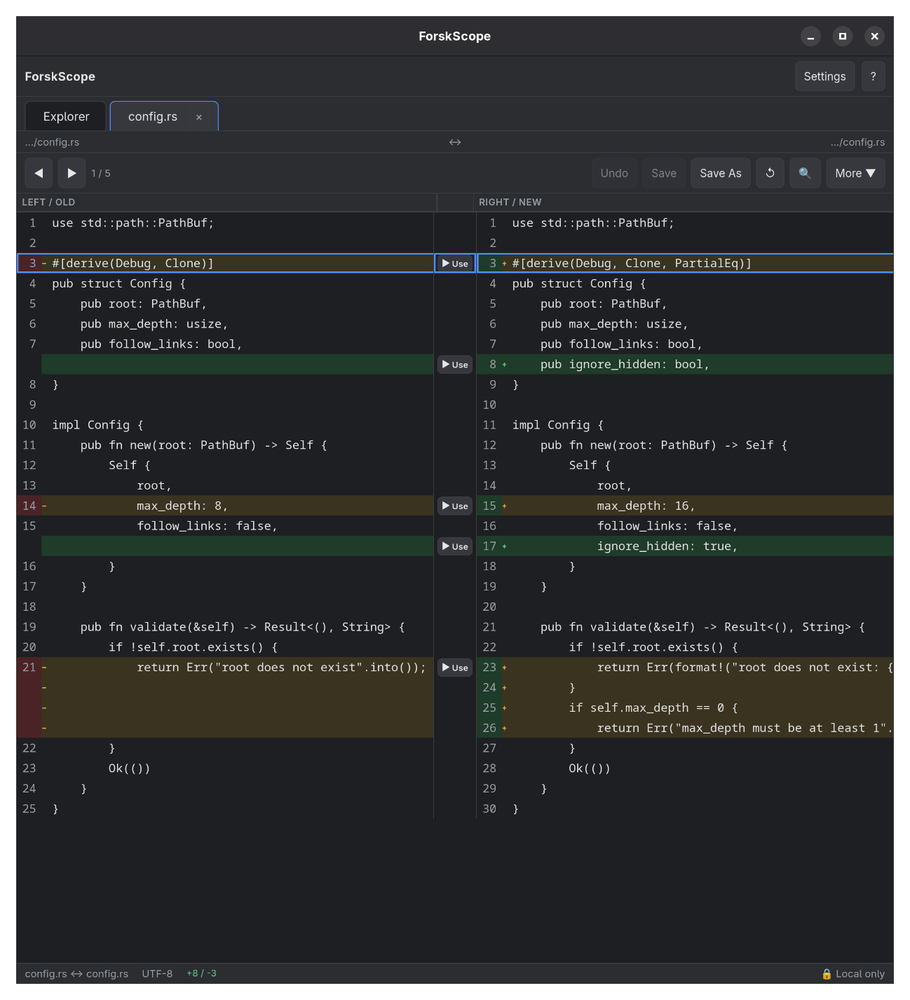
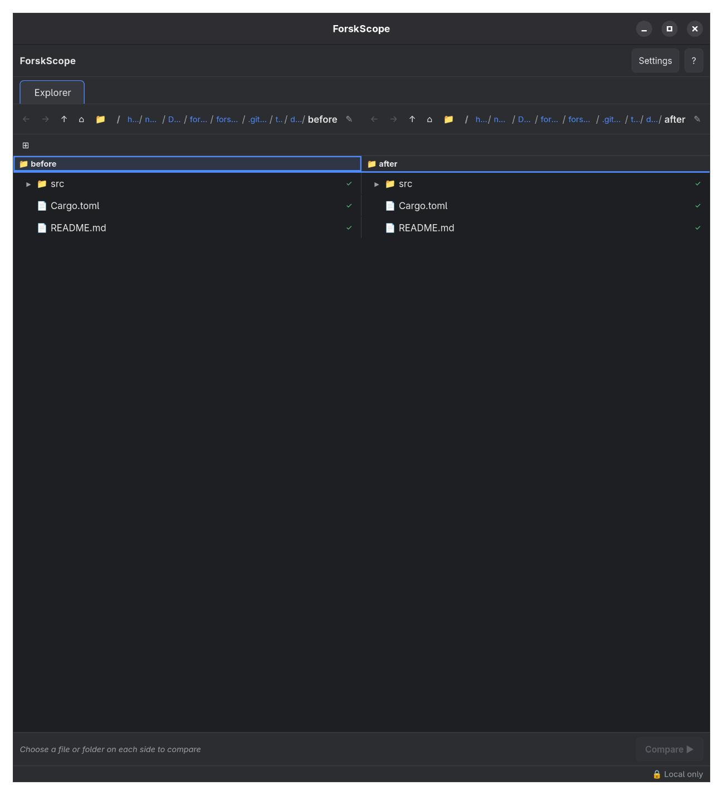

# ForskScope

[](LICENSE)
[](https://github.com/forskscope/forskscope/actions/workflows/ci.yml)
[](https://github.com/forskscope/forskscope/actions/workflows/release.yml)


Diff and merge through Exploring 🕵️‍♀️ GUI tool, local-first, with cross-platform support 💻️ named after "*forske forskjell*" (research difference) 🤍

```
forskscope old/src/main.rs new/src/main.rs
```

ForskScope opens two files (or two directories) side by side, highlights every change at line and character level, and lets you apply hunks from left to right with a single keystroke. Everything runs locally — no accounts, no uploads, no telemetry.



Every change is navigable with F7/F8 and applied with Enter or the **Use** button. Character-level highlighting shows what actually changed within a line.



Browse two directories side by side, see at a glance which files match, and open any pair in a diff tab.

---

## Why ForskScope

Most Unix/Linux workers reach for `vimdiff`, `git diff`, or a web-based paste tool when they need to compare files. These work but they don't give a persistent, navigable side-by-side view with merge support. WinMerge does — but only on Windows.

ForskScope fills that gap: a desktop app built on [Dioxus](https://dioxuslabs.com/) and a pure-Rust diff engine ([similar v3](https://docs.rs/similar)), with Linux, macOS, and Windows packaging under release-readiness verification.

---

## Install

Prebuilt binaries for Linux, macOS, and Windows are on the
[Releases page](https://github.com/forskscope/forskscope/releases). Windows is
also on the [Microsoft Store](https://apps.microsoft.com/detail/9p63f7npc3mh)
(not always the newest build).

```sh
# Linux — prebuilt (Debian/Ubuntu-family; see note below)
curl -LO https://github.com/forskscope/forskscope/releases/latest/download/forskscope-v0.166.0-linux-x86_64.tar.gz
tar -xzf forskscope-v0.166.0-linux-x86_64.tar.gz && ./forskscope

# Any distribution — build from source (Rust 1.91+)
sudo apt-get install libwebkit2gtk-4.1-dev libgtk-3-dev libxdo-dev pkg-config libssl-dev
cargo build --release -p forskscope-ui && ./target/release/forskscope
```

> The prebuilt Linux binary records `libxdo.so.3` and does not start on Arch or
> other distributions shipping libxdo 4. Build from source there — see
> [Installation](docs/src/users/installation.md) for the detail, and for macOS
> Gatekeeper and Windows WebView2 notes.

**[Full installation guide →](docs/src/users/installation.md)**

### Compare two files

```sh
forskscope old.rs new.rs
```

### Use with Git

```sh
# .gitconfig
[diff]
  tool = forskscope
[difftool "forskscope"]
  cmd = forskscope "$LOCAL" "$REMOTE"
[merge]
  tool = forskscope
[mergetool "forskscope"]
  cmd = forskscope "$LOCAL" "$REMOTE" "$MERGED"

# Then:
git difftool HEAD -- src/main.rs
git mergetool
```

---

## Features

- **Side-by-side diff** with line-level and character-level highlighting
- **Merge** — apply changes from left to right one hunk at a time; undo / redo
- **Three-way merge model** — base-aware diff3 with automatic merge of non-conflicting changes and structured conflict resolution (core model shipped; conflict workspace UI deferred post-v1)
- **Enter to apply** the focused hunk; F7/F8 to navigate; Ctrl+S to save
- **Explorer** — browse two directories, see digest equality indicators, compare same-name files with one click
- **Deep compare** — recursive directory scan with live progress; batch copy changed files between trees
- **Directory compare filter** — All / Different / Equal in the Directory Report view
- **Git difftool / mergetool** compatible (`forskscope old new` or `old remote merged`)
- **Compare profiles** — named presets for ignore-whitespace, ignore-case, and algorithm (Myers / Patience / Histogram)
- **Session persistence** — open tabs are restored on next launch
- **Patch export** — export a unified-diff `.patch` file from any file or directory comparison; compatible with `patch -p1` and `git apply`
- **Safe saves** — atomic write, `.bak` backup, external-change detection
- **Search within diff** — Ctrl+F highlights matching rows across both panes
- **Navigation history** — back/forward per explorer pane
- **Dark, Light, and Night themes**
- **English and Japanese UI** (i18n)
- **GitHub Actions gates** — CI and draft-release workflows check formatting, tests, clippy, audit policy, dependency paths, i18n, version metadata, and archive layout

---

## Keyboard shortcuts

| Key | Action |
|-----|--------|
| F7 / F8 | Previous / next change |
| Enter | Apply focused change |
| Ctrl+Z | Undo |
| Ctrl+S | Save |
| Ctrl+F | Search within diff |
| F3 / Shift+F3 | Next / previous search match |
| Ctrl+/ | Keyboard shortcut reference |

Press **?** in the header or **Ctrl+/** for the full reference.

---

## Documentation

Full documentation (built with mdbook): [`docs/src/`](docs/src/SUMMARY.md)

---

## License

Apache-2.0 — see [LICENSE](LICENSE). Author: **nabbisen**.
