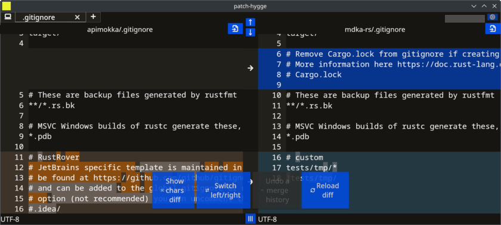

# Patch Hygge

[](https://github.com/nabbisen/patch-hygge/actions/workflows/release-executable.yaml)
[](https://github.com/nabbisen/patch-hygge/blob/main/LICENSE)

## Summary

Diff and merge 🔍️ GUI tool 💻️ with cross-platform support 🤍 powered by Tauri, Rust and Svelte.

## Executable

Available in [Assets](https://github.com/nabbisen/patch-hygge/releases/latest) in Releases.

```sh
patch-hygge <old-filepath> <new-filepath>
```

## Screenshots





