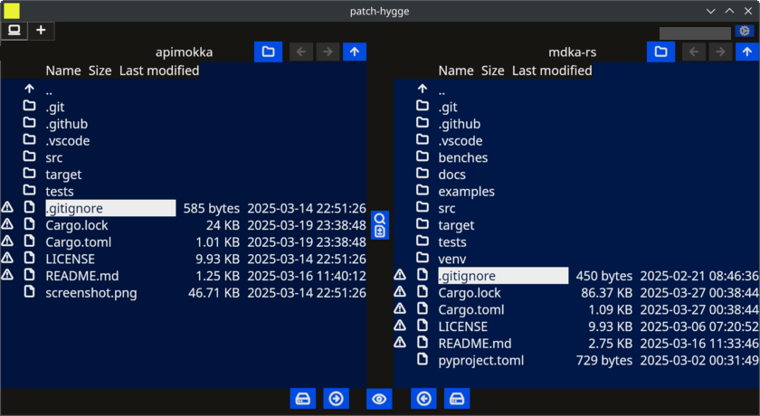

# Patch Hygge

Diff and merge GUI tool with cross-platform support build with Tauri: Rust and Svelte

## Screenshots (on the way)




## Build

With Bun:

```sh
bun run tauri build
```

Alternatively, with Node.js:

```sh
npm run tauri build
```

Some Linux distros may require environment variable set: `NO_STRIP=1`.

## Development

With Bun:

```sh
bun run tauri dev
```

Alternatively, with Node.js:

```sh
npm run tauri dev
```

Some Linux distros may require environment variable set: `WEBKIT_DISABLE_COMPOSITING_MODE=1`.

### Recommended IDE Setup

[VS Codium](https://vscodium.com/) + [Svelte](https://marketplace.visualstudio.com/items?itemName=svelte.svelte-vscode) + [Tauri](https://marketplace.visualstudio.com/items?itemName=tauri-apps.tauri-vscode) + [rust-analyzer](https://marketplace.visualstudio.com/items?itemName=rust-lang.rust-analyzer).
