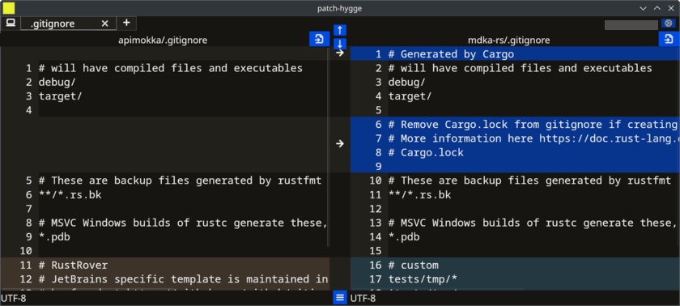

# ForskScope

[](https://github.com/nabbisen/forskscope/actions/workflows/release-executable.yaml)
[](https://github.com/nabbisen/forskscope/blob/main/LICENSE)


## Summary

Diff through Exploring 🕵️‍♀️ GUI tool with cross-platform support 💻️ named after "*forske forskjell*" (research difference) 🤍

## Screenshots





## Install

### Linux

#### ArchLinux

```sh
# install
yay -S forskscope

# uninstall
# yay -Rs forskscope
```

### Windows / Linux other distro / macOS

Executable is found in GitHub Releases: https://github.com/forskscope/forskscope/releases/latest

## Usage

```sh
forskscope

forskscope <old-filepath> <new-filepath>
```

## Features

(todo)

### Designed in mind

(todo)

## [Development](docs/README.md)

---

## Open-source, with care

This project is lovingly built and maintained by volunteers.  
We hope it helps streamline your work.  
Please understand that the project has its own direction — while we welcome feedback, it might not fit every edge case 🌱

## Acknowledgements

Depends on:

- GUI app development: [tauri](https://github.com/tauri-apps/tauri), [svelte](https://github.com/sveltejs/svelte) & [sveltekit](https://github.com/sveltejs/kit)
    - Icons: [lucide](https://github.com/lucide-icons/lucide)
    - Builder & bundler: [Vite](https://github.com/vitejs/vite)
- Differ: [similar](https://github.com/mitsuhiko/similar), [sheets-diff-rs](https://github.com/nabbisen/sheets-diff-rs)
    - Text file reader: [encoding_rs](https://github.com/hsivonen/encoding_rs) & [chardetng](https://github.com/hsivonen/chardetng)

and other helpful empowerment resources.
