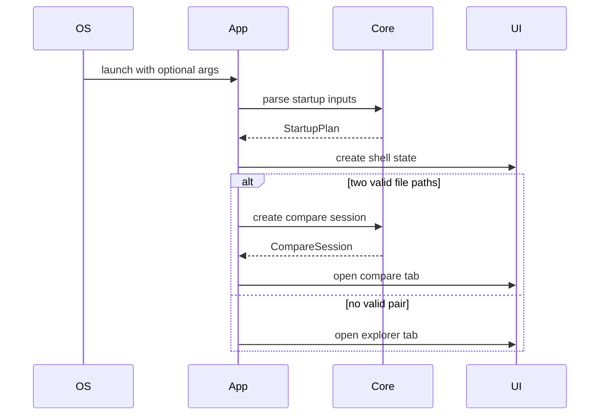

# RFC-003 — Dioxus Application Shell, State Runtime, and Workspace Model

**Status.** Implemented (v0.23.0)

---toml
project = "ForskScope"
rfc = "003"
title = "Dioxus Application Shell, State Runtime, and Workspace Model"
status = "implemented"
phase = "M3"
depends_on = ["RFC-001"]
---

## 1. Summary

Create the Dioxus desktop application shell that replaces the current Svelte/Tauri UI shell. This RFC defines the top-level window, command routing, workspace tabs, modal layer, status bar, state ownership, and interaction boundaries.

The shell is not responsible for diff truth or save truth. It is responsible for presenting workspaces and dispatching user commands to core services.

## 2. Goals

- Create `forskscope-ui-dioxus` as the primary desktop app crate.
- Define a single-window workstation layout.
- Support tabs for explorer and comparison sessions.
- Support global commands, modals, toasts, keyboard shortcuts, drag/drop, and status messages.
- Integrate with `forskscope-core` through a service boundary.
- Keep future UI replacement possible by avoiding core dependence on Dioxus types.

## 3. Non-Goals

- Implement the final editor surface.
- Implement complete directory comparison.
- Implement full settings persistence.
- Recreate every current CSS detail exactly.

## 4. Whole-App Layout

```text
┌──────────────────────────────────────────────────────────────────────────────┐
│ AppHeader                                                                    │
│  [Open Files] [Open Dirs] [Save] [Prev] [Next] [Settings]       Theme Status │
├──────────────────────────────────────────────────────────────────────────────┤
│ TabBar                                                                       │
│  [Explorer] [file_a ↔ file_b *] [report.xlsx ↔ report.xlsx]          [+] [x] │
├──────────────────────────────────────────────────────────────────────────────┤
│ WorkspaceHost                                                                │
│                                                                              │
│  Active workspace rendered here:                                             │
│  - ExplorerWorkspace                                                         │
│  - DiffMergeWorkspace                                                        │
│  - BinaryCompareWorkspace                                                    │
│  - SettingsModal / DiagnosticsModal overlaid                                 │
│                                                                              │
├──────────────────────────────────────────────────────────────────────────────┤
│ StatusBar                                                                    │
│  left path | right path | encoding | changed hunks | background job progress │
└──────────────────────────────────────────────────────────────────────────────┘
```

## 5. Dioxus Component Hierarchy

```text
App
  AppProviders
    ThemeProvider
    CommandProvider
    CoreServiceProvider
    AppShell
      AppHeader
        GlobalCommandBar
        QuickStatusCluster
      TabBar
        TabItem*
        NewTabButton
      WorkspaceHost
        ExplorerWorkspace
        DiffMergeWorkspace
        BinaryCompareWorkspace
        DirectoryReportWorkspace
      ModalHost
        SaveDialog
        ConflictDialog
        SettingsDialog
        ErrorDetailsDialog
      ToastHost
      StatusBar
```

## 6. App State Model

```rust
pub struct AppState {
    pub tabs: Vec<WorkspaceTab>,
    pub active_tab_id: TabId,
    pub modal: Option<ModalState>,
    pub toasts: Vec<ToastMessage>,
    pub background_jobs: Vec<JobSummary>,
    pub settings: UserSettings,
}

pub enum WorkspaceTab {
    Explorer(ExplorerTabState),
    Compare(CompareTabState),
    Binary(BinaryTabState),
    Report(DirectoryReportTabState),
}
```

The app state may store view state such as selected tab, scroll position hints, selected hunk ID, and modal visibility. It must not store canonical file content independently from the core session.

## 7. Command Model

```rust
pub enum AppCommand {
    OpenFiles,
    OpenDirectories,
    CloseTab(TabId),
    SaveActive,
    SaveAsActive,
    PreviousHunk,
    NextHunk,
    MergeLeftToRight,
    MergeRightToLeft,
    Undo,
    Redo,
    ShowSettings,
    ShowDiagnostics,
}
```

Commands are routed through a central dispatcher. Components may emit commands, but they should not directly mutate unrelated app state.

## 8. Startup Flow



## 9. Modal and Toast Rules

- Modals are for decisions that block destructive or ambiguous actions.
- Toasts are for transient status and non-blocking errors.
- Detailed errors must be expandable into a copyable diagnostics view.
- A failed core operation must never disappear silently.

## 10. Drag and Drop

The shell receives file/drop events and converts them into `OpenInput` commands:

```text
1 file dropped  → ask whether to set left or right side if no obvious target
2 files dropped → open compare tab
1 directory     → set explorer side or open directory tab
2 directories   → open paired explorer comparison
mixed inputs    → show interpretation dialog
```

## 11. Keyboard Shortcuts

Initial global shortcuts:

| Shortcut | Command |
|---|---|
| `Ctrl+O` | Open files |
| `Ctrl+Shift+O` | Open directories |
| `Ctrl+S` | Save active |
| `Ctrl+Shift+S` | Save as active |
| `F7` | Previous hunk |
| `F8` | Next hunk |
| `Alt+Left` | Merge right to left or navigate back depending focus |
| `Alt+Right` | Merge left to right or navigate forward depending focus |
| `Ctrl+Z` | Undo active session transaction |
| `Ctrl+Y` / `Ctrl+Shift+Z` | Redo |
| `Ctrl+,` | Settings |

Focus rules must prevent accidental merge operations while editing text unless the command is unambiguous.

## 12. External Design Requirements

- The app must feel like a desktop workstation, not a website.
- The main layout must tolerate narrow windows by collapsing secondary panels.
- The active tab must clearly show dirty state.
- Error states must be visible in the workspace, not only in logs.
- The status bar must show current operation and background jobs.

## 13. Internal Design Requirements

- Dioxus signals/state may store view state only.
- Core sessions are referenced by `SessionId` and accessed through a service layer.
- Long operations return futures or job handles.
- All UI-facing results pass through DTO/view-model conversion.
- Direct filesystem access from UI components is prohibited.

## 14. Testing Requirements

- App starts with no args.
- App starts with two file args and opens a compare tab.
- App handles invalid startup args without panic.
- Tab close with clean state closes immediately.
- Tab close with dirty state opens modal.
- Keyboard command dispatcher maps shortcuts correctly.
- Modal stack prevents background destructive actions.

## 15. Acceptance Criteria

- Dioxus app builds and launches on at least one development platform.
- The app shell can open a placeholder explorer tab and placeholder compare tab.
- Global command dispatcher exists and is tested.
- Modal/toast/status patterns are implemented at skeleton level.
- Core service access is abstracted behind a boundary.

## 16. Risks

| Risk | Mitigation |
|---|---|
| UI state becomes too global | Use tab-local states and command routing. |
| Dioxus code imports too much core internals | Use view models and service facade. |
| Keyboard shortcuts conflict with editor | RFC-004 must define editor focus precedence. |
| WebView platform quirks appear late | Add platform smoke tests in RFC-010. |

## Deferred work (v0.23.0)

Drag-and-drop file/directory opening is deferred (RFC-008 of the UI plan). Full keyboard shortcut coverage is deferred (RFC-019). The editor adapter surface (RFC-004) is not yet integrated; the diff pane uses plain Dioxus rendering without CodeMirror.
