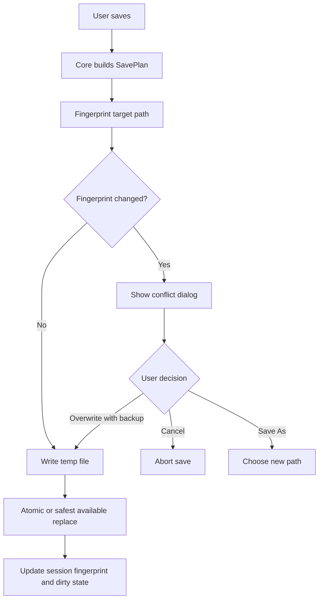
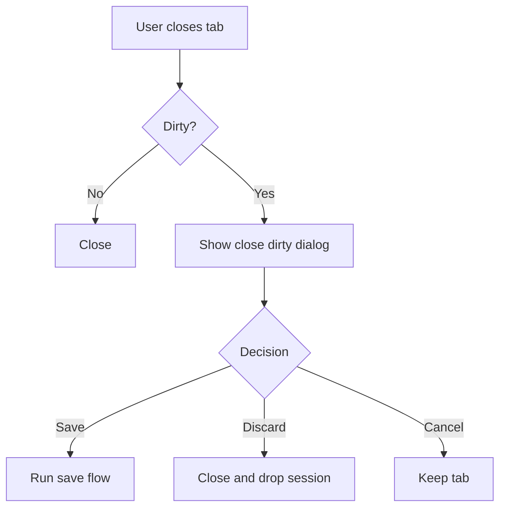

# RFC-007 — Save, Session, and File Safety Policy

**Status.** Implemented (v0.27.0)

---toml
project = "ForskScope"
rfc = "007"
title = "Save, Session, and File Safety Policy"
status = "proposed"
phase = "M7"
depends_on = ["RFC-001", "RFC-006"]
---

## 1. Summary

Define the file safety model for saving edited/merged content. ForskScope must not silently overwrite user files, corrupt encodings, or lose unsaved merge work. This RFC defines dirty state, save plans, external modification detection, backup behavior, close-tab behavior, and save result reporting.

## 2. Goals

- Track dirty state per working document and per tab.
- Detect external file modification before overwrite.
- Support Save and Save As.
- Preserve or explicitly convert encoding/newline policy.
- Offer backup creation before overwrite.
- Prevent accidental loss when closing dirty tabs.
- Represent save operations as core-domain results.

## 3. Non-Goals

- Implement cloud sync.
- Implement automatic conflict merge with external edits.
- Implement full project session restore in first release.
- Implement VCS commit integration.

## 4. Dirty State Model

```rust
pub enum DirtyState {
    Clean,
    Dirty { documents: Vec<DirtyDocument> },
    Conflict { documents: Vec<ConflictDocument> },
}

pub struct DirtyDocument {
    pub pane: PaneId,
    pub document_id: DocumentId,
    pub target_path: Option<PathBuf>,
    pub unsaved_transactions: usize,
}
```

A tab dirty marker appears when any working document has unsaved transactions.

## 5. Save Plan

```rust
pub struct SavePlan {
    pub target: SaveTarget,
    pub source_revision: DocumentRevision,
    pub encoding_policy: EncodingPolicy,
    pub newline_policy: NewlinePolicy,
    pub backup_policy: BackupPolicy,
    pub external_conflict_policy: ExternalConflictPolicy,
}

pub enum SaveTarget {
    OriginalPath { pane: PaneId },
    NewPath { path: PathBuf },
}
```

## 6. External Modification Detection

Before writing, compare the current file fingerprint with `fingerprint_at_load` or the last successful save fingerprint.



## 7. Backup Policy

```rust
pub enum BackupPolicy {
    None,
    CreateSiblingTimestamped,
    CreateConfiguredBackupDirectory,
}
```

MVP default recommendation:

```text
Create backup before overwrite when external modification is detected.
For ordinary save without conflict, backup is optional but configurable.
```

## 8. Encoding and Newline Policy

```rust
pub enum EncodingPolicy {
    PreserveOriginal,
    Utf8,
    AskIfNonUtf8,
}

pub enum NewlinePolicy {
    PreserveDominantOriginal,
    Lf,
    Crlf,
    AskIfMixed,
}
```

MVP:

- Preserve original encoding when possible.
- Warn if decoding had errors.
- Do not silently convert non-UTF-8 files to UTF-8 unless user chooses it.
- Preserve dominant newline style unless user chooses conversion.

## 9. Save Dialog Wireframe

```text
┌────────────────────────────────────────────────────────────┐
│ Save merged result                                         │
├────────────────────────────────────────────────────────────┤
│ Target: /home/user/project-new/src/main.rs                 │
│ Source: Right pane, revision 12                            │
│ Encoding: UTF-8                                            │
│ Newlines: LF                                               │
│                                                            │
│ ☑ Create backup before overwrite                           │
│                                                            │
│ [Cancel] [Save As...] [Save]                               │
└────────────────────────────────────────────────────────────┘
```

## 10. External Modification Dialog

```text
┌────────────────────────────────────────────────────────────┐
│ File changed outside ForskScope                            │
├────────────────────────────────────────────────────────────┤
│ The target file was modified after this tab loaded it.      │
│                                                            │
│ Loaded:   2026-06-08 10:30:02, 12,304 bytes                │
│ Current:  2026-06-08 10:41:19, 12,987 bytes                │
│                                                            │
│ Choose how to proceed.                                     │
│                                                            │
│ [Cancel] [Save As...] [Overwrite with Backup]              │
└────────────────────────────────────────────────────────────┘
```

## 11. Close Dirty Tab Flow



## 12. Internal Write Strategy

Preferred write algorithm:

1. Encode content to bytes according to `EncodingPolicy`.
2. Write to temporary file in same directory.
3. Flush file data.
4. Replace target with platform-appropriate atomic rename where possible.
5. Update fingerprint after successful write.
6. Remove temporary file on failure.

The implementation must document platform differences.

## 13. Testing Requirements

- Save clean UTF-8 file.
- Save non-UTF-8 file with preserve policy.
- Save As to new path.
- Close dirty tab and cancel.
- Close dirty tab and discard.
- External modification conflict.
- Backup creation.
- Permission denied on target path.
- Temporary file cleanup after failure.

## 14. Acceptance Criteria

- Dirty state is visible in tab and status bar.
- Save operation checks external modification before overwrite.
- Close dirty tab cannot lose data without explicit user action.
- Save errors are recoverable and visible.
- Encoding/newline policy is explicit in save plan.
- Unit tests cover save plan construction and conflict detection.

## 15. Risks

| Risk | Mitigation |
|---|---|
| Atomic replace behaves differently across platforms | Document platform behavior and test. |
| Encoding preservation is imperfect | Warn and require explicit conversion on uncertainty. |
| Too many dialogs slow workflow | Remember safe defaults but never hide destructive choices. |
| Backup files clutter directories | Make backup policy configurable. |

## Deferred work (v0.27.0)

Directory-level recursive sync and batch copy operations are deferred. Three-way merge is deferred (FUTURE-RFC-001). Session persistence across restarts is deferred.
