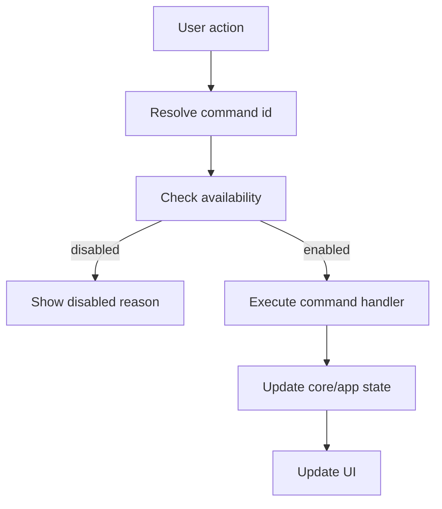

# RFC-019 — Command Registry, Keyboard Shortcuts, Command Palette, and Accessibility

**Status.** Implemented (v0.63.0) — core complete; command palette UI component, context-menu generation deferred to UI layer

## 1. Summary

This RFC defines a unified command model for Dioxus UI actions, editor actions, keyboard shortcuts, menus, toolbar buttons, context menus, and accessibility labels.

ForskScope is a worker tool. Keyboard efficiency and predictable command behavior are not optional.

## 2. Motivation

Without a command registry, the app will accumulate ad hoc event handlers:

```text
button callback
keyboard callback
editor keymap
context menu callback
toolbar callback
```

That creates inconsistent availability, inconsistent labels, and hard-to-test behavior. A command registry makes the app coherent.

## 3. Goals

- Define a central command registry.
- Define command availability rules.
- Define keyboard shortcut resolution.
- Define editor precedence.
- Define command palette behavior.
- Tie commands to accessibility labels and menu text.

## 4. Non-Goals

- This RFC does not define user scripting.
- This RFC does not require full shortcut customization in v1.
- This RFC does not define plugin commands.

## 5. Command Model

```rust
pub struct CommandDefinition {
    pub id: CommandId,
    pub label: String,
    pub description: String,
    pub category: CommandCategory,
    pub default_shortcuts: Vec<Shortcut>,
    pub availability: AvailabilityRule,
    pub danger_level: CommandDangerLevel,
}
```

```rust
pub enum CommandCategory {
    File,
    Edit,
    View,
    Navigate,
    Compare,
    Merge,
    Search,
    Settings,
    Diagnostics,
}
```

## 6. Command Availability

Availability must be derived from app state.

Examples:

| Command | Available When |
|---|---|
| Save | active tab is dirty and saveable |
| Save As | active tab has text content |
| Copy Left to Right | active hunk exists and right side is editable |
| Next Difference | active tab has diff hunks |
| Open Parent Folder | selected path exists |
| Reload Tab | active tab has source paths |
| Undo | editor or core transaction can undo |
| Redo | editor or core transaction can redo |

## 7. Shortcut Resolution

Shortcut handling order:

```text
1. Modal/dialog-specific shortcuts
2. Editor-specific shortcuts when editor has focus
3. Global app command shortcuts
4. Browser/WebView default behavior only if explicitly allowed
```

This order prevents global commands from breaking text editing.

## 8. Command Palette

### 8.1 Wireframe

```text
+--------------------------------------------------------------+
| > copy hunk                                                  |
+--------------------------------------------------------------+
| Merge: Copy Current Hunk Left → Right        Alt+Right       |
| Merge: Copy Current Hunk Right → Left        Alt+Left        |
| Edit: Copy Selected Text                     Ctrl+C          |
+--------------------------------------------------------------+
```

### 8.2 Behavior

- Opens with Ctrl+Shift+P or platform equivalent.
- Filters commands by label and category.
- Shows disabled commands with reason if useful.
- Executes selected command through the registry.
- Does not bypass availability checks.

## 9. Context Menus

Context menus must be generated from command definitions where possible.

Examples:

Explorer row context menu:

```text
Open Diff
Open Left File Externally
Open Right File Externally
Copy Left Path
Copy Right Path
Open Parent Folder
```

Diff hunk context menu:

```text
Copy Left to Right
Copy Right to Left
Mark Resolved
Revert Hunk
Copy Hunk Text
```

## 10. Accessibility Requirements

Every command-backed control must have:

- visible label or accessible label;
- disabled reason where relevant;
- keyboard path;
- focus indication;
- non-color-only state if command changes status.

Toolbar icon-only buttons must expose command labels to assistive technology.

## 11. Menu Structure

```text
File
  Open File Pair...
  Open Directory Pair...
  Save
  Save As...
  Close Tab
  Quit

Edit
  Undo
  Redo
  Find

Navigate
  Next Difference
  Previous Difference
  Next Conflict
  Previous Conflict

Merge
  Copy Current Hunk Left → Right
  Copy Current Hunk Right → Left
  Copy All Left → Right
  Copy All Right → Left

View
  Toggle Explorer
  Toggle Diagnostics
  Theme

Help
  Keyboard Shortcuts
  Diagnostics
  About
```

## 12. Command Execution Flow



## 13. Testing Requirements

- Toolbar Save and keyboard Save execute same command.
- Disabled Save cannot run from command palette.
- Editor Ctrl+Z edits text when editor focused.
- App-level Undo works outside editor.
- Merge command availability updates with active hunk.
- Command palette filters and executes commands.
- Icon buttons expose accessible labels.

## 14. Acceptance Criteria

- Core actions are command-backed.
- Shortcut conflicts are documented and resolved.
- Command palette exists or has a clear implementation slot.
- Accessibility labels derive from command metadata.
- Commands cannot bypass availability checks.

## 15. Risks

| Risk | Severity | Mitigation |
|---|---:|---|
| Editor steals important shortcuts | Medium | Precedence rules and keymap integration |
| Buttons bypass command registry | Medium | UI review rule |
| Disabled commands confuse users | Low | Disabled reason messages |
| Shortcut customization expands scope | Medium | Defer full customization |
