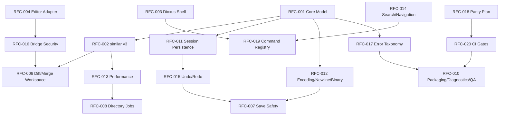

# RFC Dependency Map v0.2

## Dependency Graph

## Implementation Priority

1. RFC-018 — parity plan, because it protects migration correctness.
2. RFC-012 — encoding/newline/binary policy, because save safety depends on it.
3. RFC-011 — session persistence, because Dioxus must have stable state identities.
4. RFC-015 — undo/redo transaction log, because merge trust depends on it.
5. RFC-016 — editor bridge security, because editor integration is the highest-risk UI area.
6. RFC-013 — performance, because editor and directory work can freeze the UI.
7. RFC-014 — search/navigation, because it shapes worker usability.
8. RFC-017 — error taxonomy, because recovery UX must be consistent.
9. RFC-019 — command registry, because keyboard and menu consistency depend on it.
10. RFC-020 — CI gates, because all of the above need enforcement.

## Cross-Cutting Themes

### Product Truth

Covered by:

- RFC-001
- RFC-006
- RFC-011
- RFC-015
- RFC-016

### File Safety

Covered by:

- RFC-007
- RFC-012
- RFC-015
- RFC-017
- RFC-020

### Editor Risk

Covered by:

- RFC-004
- RFC-013
- RFC-014
- RFC-015
- RFC-016
- RFC-019

### Migration Trust

Covered by:

- RFC-042 (roadmap; originally RFC-000)
- RFC-018
- RFC-020

### Worker UX

Covered by:

- RFC-003
- RFC-005
- RFC-006
- RFC-014
- RFC-019
