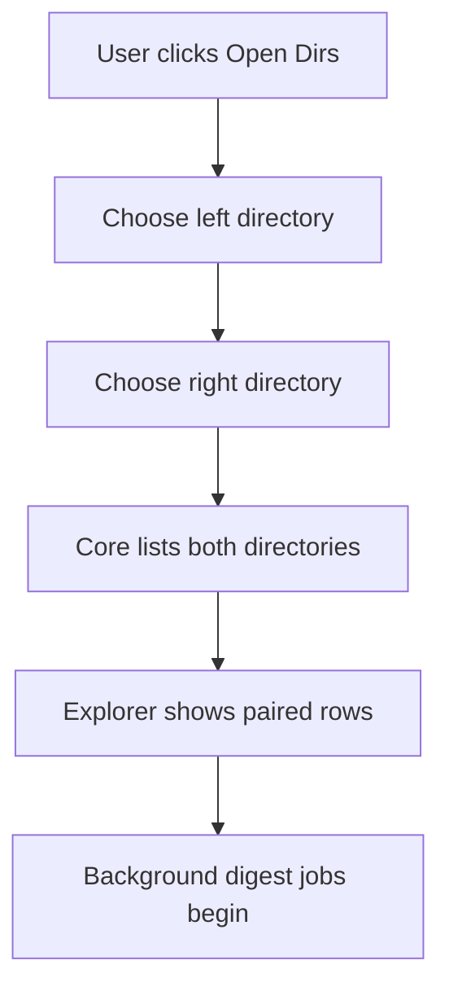
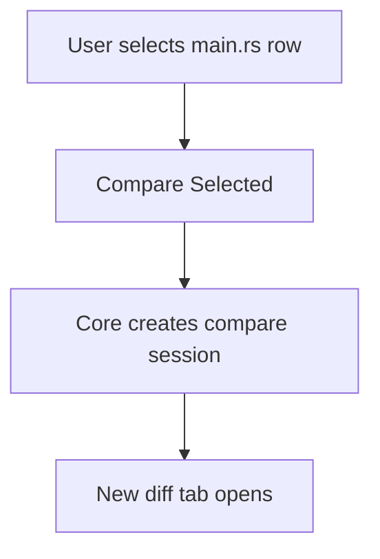

# RFC-005 — Explorer Workspace and Paired Directory Workflow

**Status.** Proposed

---toml
project = "ForskScope"
rfc = "005"
title = "Explorer Workspace and Paired Directory Workflow"
status = "proposed"
phase = "M5"
depends_on = ["RFC-001", "RFC-003"]
---

## 1. Summary

Design the Dioxus Explorer workspace that replaces the current Svelte two-pane explorer. The workspace lets users browse left and right directories, compare same-name files, open arbitrary pair comparisons, and view directory/file equality state.

## 2. Goals

- Provide a two-pane directory explorer optimized for diff workflows.
- Preserve the current app's left/right mental model.
- Support path entry, file dialog selection, parent navigation, refresh, and open-in-file-manager.
- Show file metadata and comparison state.
- Open a compare tab from selected files.
- Avoid blocking UI during expensive digest checks.

## 3. Non-Goals

- Implement full recursive directory diff report in this RFC.
- Implement project/workspace persistence.
- Implement VCS integration.
- Implement remote filesystem browsing.

## 4. Workspace Wireframe

```text
┌──────────────────────────────────────────────────────────────────────────────┐
│ Explorer Toolbar                                                             │
│ [Open Left Dir] [Open Right Dir] [Refresh] [Compare Selected] [Swap]         │
├──────────────────────────────────────┬───────────────────────────────────────┤
│ Left Directory                        │ Right Directory                       │
│ /home/user/project-old          [..]  │ /home/user/project-new           [..] │
├──────────────────────────────────────┼───────────────────────────────────────┤
│ Dirs                                 │ Dirs                                  │
│  ▸ src                               │  ▸ src                                │
│  ▸ tests                             │  ▸ tests                              │
│                                      │                                       │
│ Files                                │ Files                                 │
│  ≠ main.rs          12 KB  2026...   │  ≠ main.rs          13 KB  2026...    │
│  = Cargo.toml       1 KB   2026...   │  = Cargo.toml       1 KB   2026...    │
│  ← only-old.txt     2 KB   2026...   │  → only-new.txt     3 KB   2026...    │
├──────────────────────────────────────┴───────────────────────────────────────┤
│ Status: 2 different, 1 equal, 2 one-sided, background checks complete         │
└──────────────────────────────────────────────────────────────────────────────┘
```

## 5. Explorer View Model

```rust
pub struct ExplorerViewModel {
    pub left: DirectoryPaneView,
    pub right: DirectoryPaneView,
    pub pair_summary: DirectoryPairSummary,
    pub selected_pair: Option<FilePairSelection>,
    pub background_jobs: Vec<JobSummary>,
    pub warnings: Vec<UserWarning>,
}

pub struct DirectoryPaneView {
    pub side: Side,
    pub current_dir: Option<PathDisplay>,
    pub parent_available: bool,
    pub dirs: Vec<DirRowView>,
    pub files: Vec<FileRowView>,
    pub loading: bool,
    pub error: Option<UserError>,
}
```

## 6. Row States

```rust
pub enum PairState {
    Unknown,
    Equal,
    Different,
    LeftOnly,
    RightOnly,
    TypeMismatch,
    Error,
}
```

Row visuals:

| State | Visual Meaning |
|---|---|
| Equal | subdued/check marker |
| Different | strong diff marker |
| LeftOnly/RightOnly | one-sided marker |
| TypeMismatch | warning marker |
| Error | error marker with detail |
| Unknown | pending spinner or neutral state |

## 7. User Workflows

### 7.1 Open Two Directories



### 7.2 Compare Same-Name File



### 7.3 Navigate Into Paired Directory

```text
Double-click common directory row
→ both panes navigate into that directory name
→ row states refresh
```

If the directory exists only on one side, only that side navigates and the opposite side shows missing-state context.

## 8. Commands

```rust
pub enum ExplorerCommand {
    SetDirectory { side: Side, path: PathBuf },
    NavigateParent { side: Side },
    NavigateChild { side: Side, name: String },
    Refresh { side: Option<Side> },
    SelectRow { side: Side, name: String },
    CompareSelected,
    CompareNamedPair { name: String },
    SwapSides,
    OpenInFileManager { side: Side },
}
```

## 9. Background Digest Policy

The explorer must not compute all digest comparisons synchronously in the render path.

Rules:

- Metadata listing is fast path.
- Digest checks run as jobs.
- Visible rows are prioritized.
- Jobs are cancelled when navigating away.
- Results update row state incrementally.

RFC-008 defines the full background job model.

## 10. Accessibility Requirements

- Directory panes must have clear labels: "Left directory" and "Right directory".
- Rows must be keyboard navigable.
- Pair state must not rely on color alone.
- `Enter` opens/navigates; `Space` selects; context menu is keyboard reachable.
- Screen reader text must include filename, side, size, modified time, and pair state.

## 11. Testing Requirements

- Empty directory.
- Directory with files only.
- Directory with dirs only.
- Matching file names with equal content.
- Matching file names with different content.
- Left-only and right-only files.
- Permission denied directory.
- Navigation cancellation while digest jobs run.

## 12. Acceptance Criteria

- Explorer opens by default when no startup file pair exists.
- User can select two directories and see side-by-side listings.
- User can open a compare tab from a selected pair.
- Row pair states update without freezing the UI.
- Errors are shown in-pane.
- Keyboard navigation works for core operations.

## 13. Risks

| Risk | Mitigation |
|---|---|
| Digest comparison blocks UI | Use RFC-008 background jobs. |
| Pairing logic becomes confusing for one-sided directories | Explicit pair states and status text. |
| Explorer becomes a file manager clone | Keep scope limited to compare workflows. |
| Large directories overwhelm view | Add incremental loading/filtering later. |
