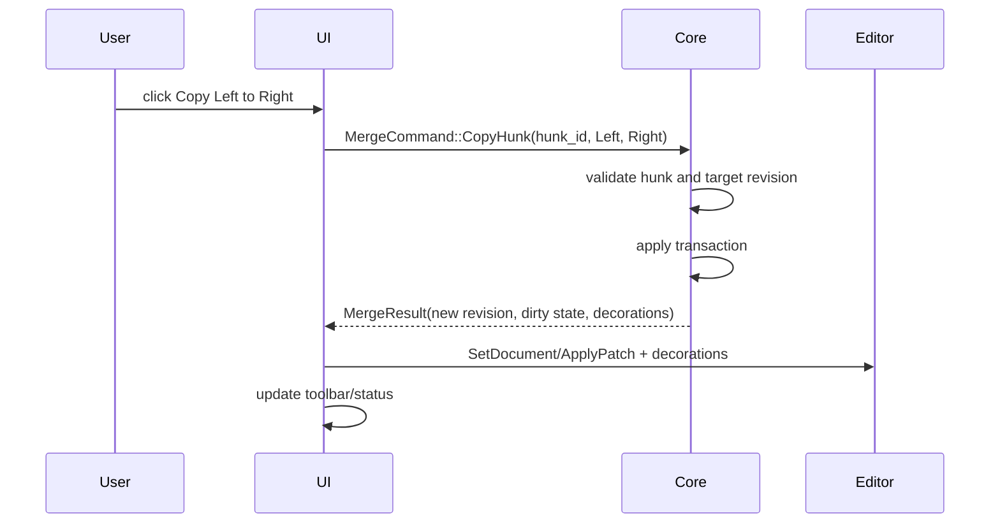

# RFC-006 — Diff/Merge Workspace and Merge Transaction Model

**Status.** Proposed

---toml
project = "ForskScope"
rfc = "006"
title = "Diff/Merge Workspace and Merge Transaction Model"
status = "proposed"
phase = "M6"
depends_on = ["RFC-002", "RFC-004"]
---

## 1. Summary

Design the main side-by-side diff/merge workspace. This workspace is the product heart of ForskScope. It displays line and inline differences, supports hunk navigation, applies merge commands, tracks dirty state, and integrates with the editor adapter.

## 2. Goals

- Provide a clear two-pane diff/merge workspace.
- Support hunk navigation and current-hunk focus.
- Support merge left-to-right and right-to-left.
- Represent merge operations as transactions owned by Rust core.
- Support undo/redo through transaction history.
- Keep editor content synchronized with the canonical merge model.

## 3. Non-Goals

- Full three-way merge.
- Advanced conflict resolver.
- VCS integration.
- Language-aware semantic merge.
- Final search/replace feature set.

## 4. Workspace Wireframe

```text
┌──────────────────────────────────────────────────────────────────────────────┐
│ Diff Toolbar                                                                 │
│ [Prev Hunk] [Next Hunk] [Copy →] [← Copy] [Undo] [Redo] [Save] [Options]     │
├──────────────────────────────────────┬───────────────────────────────────────┤
│ Left: old/main.rs  UTF-8             │ Right: new/main.rs  UTF-8       *     │
├──────────────────────────────────────┼───────────────────────────────────────┤
│  10 │ fn main() {                    │  10 │ fn main() {                     │
│  11 │ - println!("old");             │  11 │ + println!("new");              │
│     │   ^^^^^                         │     │   ^^^^^                         │
│  12 │ }                              │  12 │ }                               │
├──────────────────────────────────────┴───────────────────────────────────────┤
│ Hunk 3/12 | Replace | unsaved right side | external file unchanged           │
└──────────────────────────────────────────────────────────────────────────────┘
```

## 5. Merge Session Model

```rust
pub struct MergeSession {
    pub merge_id: MergeId,
    pub base_diff_id: DiffId,
    pub left_working: WorkingDocument,
    pub right_working: WorkingDocument,
    pub active_hunk: Option<HunkId>,
    pub transactions: TransactionLog,
    pub dirty: DirtyState,
}

pub struct WorkingDocument {
    pub document_id: DocumentId,
    pub revision: DocumentRevision,
    pub content: String,
    pub source: WorkingDocumentSource,
}
```

MVP may choose right side as the primary editable result, but the model should allow both sides to become editable later.

## 6. Merge Transactions

```rust
pub struct MergeTransaction {
    pub transaction_id: TransactionId,
    pub base_revision: DocumentRevision,
    pub target_pane: PaneId,
    pub operation: MergeOperation,
    pub before: TextPatchSnapshot,
    pub after: TextPatchSnapshot,
    pub created_at: SystemTime,
}

pub enum MergeOperation {
    CopyHunk { hunk_id: HunkId, from: Side, to: Side },
    ApplyEditorChange { changes: Vec<TextChange> },
    RevertHunk { hunk_id: HunkId, side: Side },
}
```

Undo and redo operate on transactions, not raw editor history alone.

## 7. Hunk Navigation

The workspace maintains:

```rust
pub struct HunkNavigationState {
    pub ordered_hunks: Vec<HunkId>,
    pub current: Option<HunkId>,
    pub filter: HunkFilter,
}
```

Navigation commands:

- Previous hunk.
- Next hunk.
- First hunk.
- Last hunk.
- Next unresolved hunk.

## 8. Merge Command Flow



## 9. Conflict and Stale-Hunk Handling

If the user edits a document after diff calculation, hunk line ranges may become stale. The core must detect this.

Options:

1. Recompute diff after each transaction for MVP simplicity.
2. Track patches and map hunk ranges forward.
3. Disable stale hunk merge command until refresh.

Recommended MVP: recompute diff after merge operations for small/medium files; for large files, mark hunk status stale and offer refresh.

## 10. View Model

```rust
pub struct DiffMergeViewModel {
    pub session_id: SessionId,
    pub title: String,
    pub left_header: PaneHeaderView,
    pub right_header: PaneHeaderView,
    pub hunk_summary: HunkSummaryView,
    pub toolbar: DiffToolbarState,
    pub editor_documents: EditorDocumentPair,
    pub decorations: EditorDecorationSet,
    pub status: DiffStatusLine,
}
```

## 11. User Workflows

### 11.1 Review Differences

```text
Open diff tab
→ first changed hunk selected
→ user navigates with F7/F8
→ editor reveals current hunk
→ status bar shows hunk number and kind
```

### 11.2 Merge One Hunk

```text
Select changed hunk
→ click Copy →
→ core applies transaction to right working document
→ dirty marker appears on tab
→ editor updates right pane
→ undo becomes available
```

### 11.3 Edit Text Manually

```text
User types in editable pane
→ editor emits TextChange
→ core applies ApplyEditorChange transaction
→ dirty state updates
→ diff is refreshed or marked stale according to policy
```

## 12. Testing Requirements

- Copy insert/delete/replace hunks in both directions.
- Undo/redo merge operation.
- Manual edit creates dirty transaction.
- Stale hunk operation is rejected safely.
- Current hunk navigation skips equal hunks by default.
- Unicode text survives merge operations.
- Newline style is preserved according to document policy.

## 13. Acceptance Criteria

- Side-by-side diff display is driven by `DiffDocument`.
- Hunk navigation works with stable hunk IDs.
- Merge commands are model-backed transactions.
- Dirty state updates after merge/edit.
- Undo/redo works for merge transactions.
- Editor decorations reflect line and inline diff state.

## 14. Risks

| Risk | Mitigation |
|---|---|
| Free editing destabilizes hunk model | Start with controlled merge then add editable mode. |
| Re-diff after each edit is expensive | Use stale marker and explicit refresh for large files. |
| Undo history conflicts with editor native undo | Route editor undo through adapter/core where possible. |
| Users misunderstand target side | Strong toolbar labels and side headers. |
