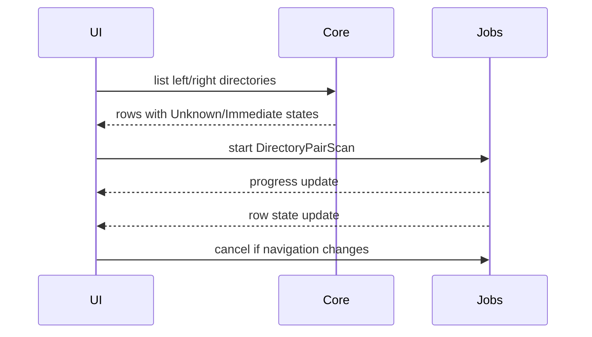

# RFC-008 — Directory Comparison and Background Job Model

**Status.** Proposed — EqualityEvidence + pair_entries (v0.58.0); JobStatus + JobStatusRecord + JobRegistry (v0.68.0); background job runner and UI open

---toml
project = "ForskScope"
rfc = "008"
title = "Directory Comparison and Background Job Model"
status = "proposed"
phase = "M8"
depends_on = ["RFC-001", "RFC-005"]
---

## 1. Summary

Define the background job model for directory comparison, digest calculation, progress reporting, cancellation, and explorer row updates. Directory comparison must not block Dioxus rendering or editor responsiveness.

## 2. Goals

- Compare paired directory listings without UI freeze.
- Compute file equality/difference using metadata and digest policy.
- Support cancellation when users navigate away.
- Show progress and partial results.
- Provide an internal job model reusable by future long operations.

## 3. Non-Goals

- Full recursive report UI in first implementation.
- Network/distributed comparison.
- Content-aware diff for every file in a directory automatically.
- Continuous filesystem watcher.

## 4. Job Model

```rust
pub struct JobId(String);

pub struct BackgroundJob {
    pub job_id: JobId,
    pub kind: JobKind,
    pub status: JobStatus,
    pub progress: JobProgress,
    pub created_at: SystemTime,
}

pub enum JobKind {
    DirectoryPairScan { left: PathBuf, right: PathBuf },
    FileDigest { left: Option<PathBuf>, right: Option<PathBuf> },
    RecursiveDirectoryScan { left: PathBuf, right: PathBuf },
}

pub enum JobStatus {
    Queued,
    Running,
    Completed,
    Cancelled,
    Failed { message: String },
}
```

## 5. Digest Comparison Policy

```rust
pub enum EqualityEvidence {
    MetadataEqual,
    DigestEqual,
    DigestDifferent,
    MissingOneSide,
    TypeMismatch,
    Error { message: String },
    Unknown,
}
```

Recommended strategy:

1. Pair rows by filename.
2. If one side missing, mark one-sided immediately.
3. If file type differs, mark type mismatch.
4. If size differs, mark different without digest.
5. If size and metadata strongly match, mark likely equal or queue digest depending settings.
6. If uncertain, queue digest job.

## 6. Progress Reporting

```rust
pub struct JobProgress {
    pub total_units: Option<u64>,
    pub completed_units: u64,
    pub current_label: Option<String>,
}
```

Progress should be visible in both the status bar and explorer footer.

## 7. Cancellation

Cancellation rules:

- Navigating away from a directory pair cancels outstanding jobs for that pair.
- Closing explorer tab cancels jobs owned by that tab.
- User can manually cancel long-running comparison.
- Cancellation must leave partial results clearly marked as incomplete.

## 8. Explorer Integration Flow



## 9. Threading / Async Boundary

The implementation may use async tasks, a thread pool, or Dioxus-supported background task patterns. The core requirement is:

```text
No digest calculation or recursive directory scan may run synchronously in a render path.
```

## 10. Caching

MVP may use in-memory cache:

```rust
pub struct DigestCacheKey {
    pub path: PathBuf,
    pub len: u64,
    pub modified_unix_nanos: Option<i128>,
}
```

Persistent cache is not required in the first release.

## 11. User-Facing States

| State | UI Display |
|---|---|
| Queued | neutral pending icon |
| Running | spinner/progress |
| Equal | equal marker |
| Different | diff marker |
| Error | warning marker with details |
| Cancelled | incomplete marker |

## 12. Testing Requirements

- Compare directories with equal files.
- Compare directories with different sizes.
- Compare same-size different content.
- Compare missing left/right files.
- Permission denied while digesting.
- Cancellation while many files remain.
- Navigation cancels stale jobs.
- Cache hit avoids repeated digest.

## 13. Acceptance Criteria

- Directory row state updates asynchronously.
- UI remains responsive during large directory comparison.
- Jobs can be cancelled.
- Partial/incomplete results are clearly represented.
- Errors are row-specific where possible.
- Background job summary appears in status bar.

## 14. Risks

| Risk | Mitigation |
|---|---|
| Digest work still saturates disk | Limit concurrency and prioritize visible rows. |
| Row updates race with navigation | Scope jobs by tab/session generation ID. |
| Cache returns stale equality | Include fingerprint fields in cache key. |
| Recursive compare scope grows too large | Keep recursive report as future enhancement. |
