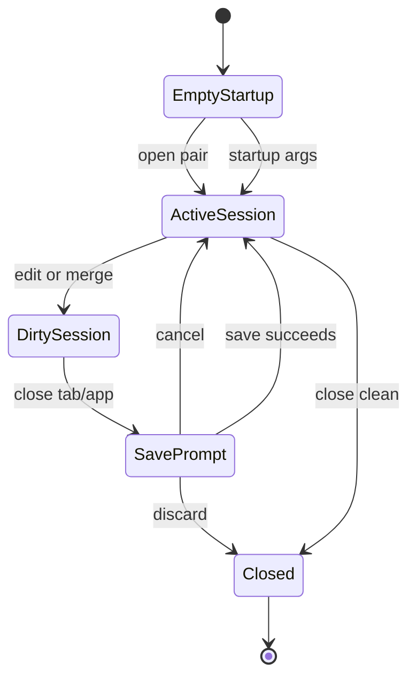

# RFC-011 — Workspace Session Persistence

**Status.** Proposed

## 1. Summary

This RFC defines how ForskScope should represent, persist, restore, and close comparison workspace sessions in the Dioxus migration.

A workspace session is the user-facing unit of work. It may contain directory comparison state, multiple diff tabs, dirty merge results, selected paths, scroll positions, and unsaved decisions. The current application has tab-like behavior, but the next architecture must make session state explicit and model-backed.

## 2. Motivation

A diff/merge tool is trusted only when users can understand what is open, what has changed, and what will be saved.

The current app can open comparisons and tabs, but the next design needs stronger guarantees:

- tabs must not be merely UI components;
- merge state must survive redraws and route changes;
- closing a tab must check dirty state;
- reopening recent comparisons should be possible;
- startup arguments should create an initial comparison session;
- future crash recovery should have a clean extension point.

## 3. Goals

- Define a canonical `WorkspaceSession` model.
- Separate transient UI state from restorable session state.
- Support multiple comparison tabs.
- Support startup from no path, one path, or two paths.
- Support recent sessions without requiring full project-file management.
- Provide a future path for crash recovery.

## 4. Non-Goals

- This RFC does not define a full project file format.
- This RFC does not introduce cloud synchronization.
- This RFC does not persist file contents by default.
- This RFC does not implement collaborative sessions.

## 5. User-Facing Behavior

### 5.1 Empty Startup

When the app starts without arguments:

```text
+--------------------------------------------------------------+
| ForskScope                                                   |
+--------------------------------------------------------------+
| Toolbar: [Open File Pair] [Open Directory Pair] [Recent]     |
+--------------------------------------------------------------+
|                                                              |
|                      Start Comparison                        |
|                                                              |
|   [ Compare two files ]     [ Compare two folders ]           |
|                                                              |
|   Recent:                                                    |
|   - /project/a ↔ /project/b                                  |
|   - old/main.rs ↔ new/main.rs                                |
|                                                              |
+--------------------------------------------------------------+
```

### 5.2 Startup With Two Files

When the app starts with two valid file paths, it should open a diff tab immediately.

```text
WorkspaceSession
  root_kind = FilePair
  tabs = [DiffTab(left_path, right_path)]
  active_tab = first tab
```

### 5.3 Startup With Two Directories

When the app starts with two directory paths, it should open the explorer workspace.

```text
WorkspaceSession
  root_kind = DirectoryPair
  explorer.left_root = left directory
  explorer.right_root = right directory
  tabs = []
```

### 5.4 Closing a Dirty Tab

If a tab has unsaved changes, closing it must show a decision dialog.

```text
+--------------------------------------------------------------+
| Unsaved Changes                                              |
+--------------------------------------------------------------+
| The comparison "foo.rs ↔ foo.rs" has unsaved merge edits.    |
|                                                              |
| [Save...] [Discard Changes] [Cancel]                         |
+--------------------------------------------------------------+
```

## 6. Session Model

```rust
pub struct WorkspaceSession {
    pub session_id: SessionId,
    pub created_at: Timestamp,
    pub updated_at: Timestamp,
    pub root: WorkspaceRoot,
    pub tabs: Vec<WorkspaceTab>,
    pub active_tab_id: Option<TabId>,
    pub recent_commands: Vec<CommandRecord>,
    pub ui_restore: UiRestoreState,
}

pub enum WorkspaceRoot {
    Empty,
    FilePair(FilePairRoot),
    DirectoryPair(DirectoryPairRoot),
}

pub enum WorkspaceTab {
    Diff(DiffTabSession),
    Binary(BinaryCompareSession),
    Excel(ExcelCompareSession),
    Error(ErrorTabSession),
}
```

## 7. Restorable vs Transient State

### 7.1 Restorable State

Restorable state may be saved in a local session cache:

- root paths;
- open tab path pairs;
- active tab identity;
- selected explorer rows;
- scroll positions;
- chosen diff options;
- dirty flag summary;
- editor selection hints, if safe.

### 7.2 Transient State

Transient state must not be persisted:

- modal-open state;
- current toast messages;
- raw editor DOM state;
- background job handles;
- platform-specific temporary paths;
- unresolved save conflict prompts.

## 8. Session Persistence Format

The recommended persistence format is a versioned JSON or TOML file in the application config directory.

```toml
schema_version = 1
session_id = "..."
updated_at = "..."
root_kind = "directory_pair"
left_root = "/work/project-old"
right_root = "/work/project-new"
active_tab_id = "tab-2"
```

The first implementation may use JSON for direct Rust serialization. TOML is acceptable if readability is preferred. The critical requirement is schema versioning.

## 9. Recent Sessions

Recent sessions must store only metadata and paths, not file contents.

```rust
pub struct RecentSessionEntry {
    pub entry_id: RecentEntryId,
    pub title: String,
    pub left_path: PathBuf,
    pub right_path: PathBuf,
    pub kind: RecentKind,
    pub last_opened_at: Timestamp,
}
```

Rules:

- Missing paths remain visible but marked unavailable.
- Selecting an unavailable recent entry shows a clear error and offers removal.
- Sensitive file contents are not cached.

## 10. Session Lifecycle



## 11. App Close Flow

When the app window is closing:

1. Collect all dirty tabs.
2. If none are dirty, persist restorable session metadata and close.
3. If dirty tabs exist, show a single close confirmation dialog.
4. Let the user save individually, discard all, or cancel close.
5. Never auto-save dirty content without explicit user action.

## 12. Internal Design Requirements

- `WorkspaceSession` must live outside Dioxus component local state.
- Dioxus signals may mirror the session, but the canonical session model must be stored in the app runtime state.
- Editor instances must be reattached to tab sessions by `TabId`, not by component instance identity.
- `SessionId` and `TabId` must be stable across redraws.

## 13. Testing Requirements

- Create an empty session.
- Create a file-pair session from startup args.
- Create a directory-pair session from startup args.
- Open multiple diff tabs.
- Close clean tab.
- Attempt to close dirty tab and cancel.
- Save dirty tab and close.
- Restore recent session with existing paths.
- Restore recent session with missing paths.
- Validate schema-version compatibility.

## 14. Acceptance Criteria

- Users can see what is open and what is dirty.
- Session identity is not lost during UI redraw.
- Closing dirty work is guarded.
- Recent sessions do not store file contents.
- Startup args map predictably to initial workspace state.

## 15. Risks

| Risk | Severity | Mitigation |
|---|---:|---|
| Session format becomes too large | Medium | Store metadata only |
| Editor DOM state leaks into session | High | Persist only model-level state |
| Startup args become platform fragile | Medium | Normalize through core path service |
| Dirty tabs are lost on close | Critical | Single close guard across all tabs |

## 16. Open Questions

- Should session restore be enabled by default or only recent entries?
- Should the app restore the last workspace automatically?
- Should dirty state be recoverable after crash in v1, or deferred?
