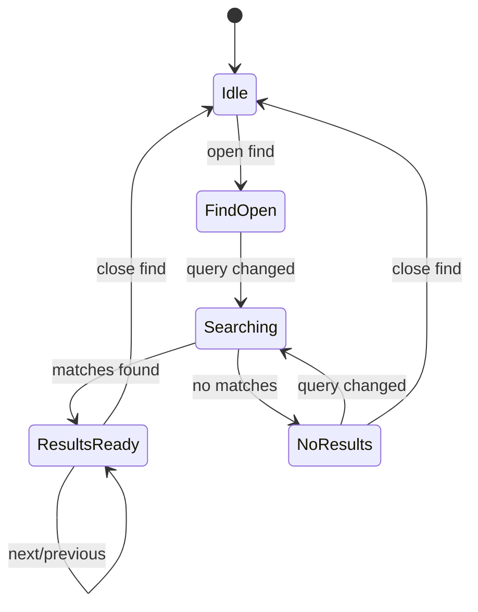

# RFC-014 — Search, Filter, and Navigation

**Status.** Proposed — search next/prev traversal slice implemented (v0.43.0); explorer filter and command palette open

## Status
Partially implemented in v0.43.0. In-diff text search upgraded from a
static match counter to a full navigable index:

- **`MatchIndex`** in `forskscope-explorer-align` crate — a pure data engine
  (no Dioxus dependency) that builds an ordered list of `(hunk_id,
  row_index, side)` match positions from a hunk snapshot and a query, then
  supports `next()` / `prev()` traversal with wrapping, `reset_focus()`,
  `matching_hunk_ids()`, and `is_focused()`. 13 unit tests.
- **`SearchBar`** updated — Prev (▲) / Next (▼) buttons with keyboard
  equivalents (Enter / Shift+Enter), focused-match counter ("3 / 12"),
  "No matches" label, `aria-live` count region.
- **Auto-expand** — hunks containing matches are auto-expanded so results
  are visible without manual expand interaction.
- **Scroll-to-match** — `scrollIntoView` fires on next/prev/first-match via
  `dioxus::document::eval`.
- **F3** keyboard shortcut wired in `app.rs` alongside existing F7/F8.

Remaining open: Explorer file/directory filter UI, command palette
integration (RFC-019), whole-word and regex modes (behind disclosure,
deferred), and cross-tab project-wide search.

This RFC defines search, filter, and navigation behavior for the Dioxus migration.

ForskScope must help users move through differences quickly. Without strong navigation, a diff/merge app becomes a passive viewer rather than a worker tool.

## 2. Motivation

The app needs several distinct navigation layers:

- explorer filtering for files/directories;
- tab navigation;
- hunk navigation;
- text search within diff panes;
- command search through a command palette;
- error/result navigation.

These must not be implemented as unrelated local UI tricks. They should share command and focus rules.

## 3. Goals

- Define explorer filtering.
- Define text search in left/right/merged panes.
- Define hunk navigation.
- Define result list UI.
- Define interaction with editor focus and keyboard shortcuts.
- Make navigation accessible.

## 4. Non-Goals

- This RFC does not implement full IDE-grade symbol search.
- This RFC does not define regex replace in v1.
- This RFC does not define project-wide content search outside opened comparison roots.

## 5. Explorer Filter

### 5.1 Wireframe

```text
+--------------------------------------------------------------+
| Explorer                                                     |
| Left Root:  /old/project       Right Root: /new/project       |
| Filter: [ changed *.rs____________________ ] [x]              |
+--------------------------------------------------------------+
| Status | Name                  | Left        | Right          |
| M      | src/main.rs           | 12 KB       | 13 KB          |
| L      | src/legacy.rs         | 8 KB        | missing        |
| R      | src/new.rs            | missing     | 3 KB           |
+--------------------------------------------------------------+
```

### 5.2 Filter Syntax

Initial filter syntax should be simple:

```text
plain text       match name/path substring
*.rs             glob-like extension match
changed          show modified rows
left-only        show rows missing on right
right-only       show rows missing on left
binary           show binary-only rows
```

The UI may later expose structured chips instead of requiring users to memorize tokens.

## 6. Hunk Navigation

Commands:

```text
Next Difference
Previous Difference
Next Conflict
Previous Conflict
First Difference
Last Difference
Copy Current Hunk Left to Right
Copy Current Hunk Right to Left
Mark Current Hunk Resolved
```

State:

```rust
pub struct HunkNavigationState {
    pub active_hunk_id: Option<HunkId>,
    pub visible_hunk_ids: Vec<HunkId>,
    pub total_hunks: usize,
    pub unresolved_hunks: usize,
}
```

## 7. Text Search

### 7.1 Search Scope

```rust
pub enum SearchScope {
    ActivePane,
    LeftPane,
    RightPane,
    BothPanes,
    CurrentTab,
}
```

### 7.2 Search Options

```rust
pub struct SearchOptions {
    pub query: String,
    pub case_sensitive: bool,
    pub whole_word: bool,
    pub regex: bool,
    pub scope: SearchScope,
}
```

Regex support may be deferred, but the UI should reserve space for it if the implementation cost is acceptable.

### 7.3 Search Bar Wireframe

```text
+--------------------------------------------------------------+
| Find: [ init_component________________ ]  3 / 18              |
| [Aa] [Word] [Regex] Scope: [Both panes v] [Prev] [Next] [x]  |
+--------------------------------------------------------------+
```

## 8. Search Result Rendering

Search results must be distinguishable from diff decorations.

Decoration priority:

```text
active search result > active hunk > inline diff > line diff background
```

The color theme must provide a non-color-only signal such as border/underline where possible.

## 9. Navigation State Machine



## 10. Editor Integration

The editor adapter must support:

- highlight search ranges;
- scroll to search result;
- report current selection;
- preserve editor focus after search command;
- avoid destroying undo history when search decorations change.

## 11. Keyboard Requirements

Recommended defaults:

| Command | Shortcut |
|---|---|
| Find | Ctrl+F / Cmd+F |
| Next search result | Enter or F3 |
| Previous search result | Shift+Enter or Shift+F3 |
| Next hunk | Alt+Down |
| Previous hunk | Alt+Up |
| Focus explorer filter | Ctrl+L if explorer focused, or configurable |
| Clear filter/search | Escape |

Editor-specific conflicts must be resolved by the command registry defined in RFC-019.

## 12. Accessibility Requirements

- Search result count must be announced to assistive technology.
- No-results state must be textual, not only color.
- Active hunk must have visible focus indication.
- Keyboard navigation must not trap focus permanently inside the editor.

## 13. Testing Requirements

- Filter changed files.
- Filter left-only/right-only rows.
- Search in left pane only.
- Search in both panes.
- Navigate next/previous search result.
- Navigate hunks after editing.
- Ensure search decoration does not change document text.
- Ensure Escape closes the correct layer.

## 14. Acceptance Criteria

- Users can quickly find files and hunks.
- Search and hunk navigation do not conflict with merge commands.
- Search state is scoped to tab/session appropriately.
- Keyboard-only use is possible for core navigation.

## 15. Risks

| Risk | Severity | Mitigation |
|---|---:|---|
| Search decorations interfere with diff highlights | Medium | Decoration priority policy |
| Keyboard conflicts with editor | High | Central command registry |
| Filtering hides active selection confusingly | Medium | Show hidden-selection notice or reset selection |
| Regex search causes performance problems | Medium | Defer or bound regex search |
