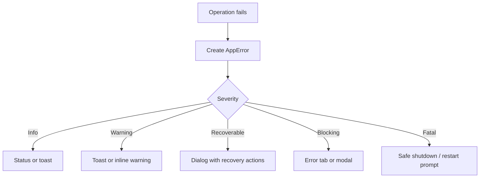

# RFC-017 — Error Taxonomy and Diagnostics UX

**Status.** Proposed — error severity and recovery hints slice implemented (v0.46.0); diagnostics panel and AppError wrapper open

## Status
Partially implemented in v0.46.0:

- **`ErrorSeverity`** (Info / Warning / Recoverable / Blocking) — an `Ord`
  enum, exported from `forskscope-core`. The `CoreError::severity()` method
  returns the appropriate level for each variant: Conflict → Recoverable,
  read/listdir I/O → Recoverable, write/rename I/O → Blocking, Decode →
  Warning, InternalInvariant → Blocking.
- **`RecoveryHint`** — a predefined action the UI should offer alongside the
  error: ChooseAnotherFile, Reload, SaveAs, OverwriteAnyway,
  CheckPermissions, Dismiss, ReportBug. `CoreError::recovery_hint()` maps
  each variant.
- **`CoreError::is_user_recoverable()`** — convenience predicate for the
  common UI branch-on-severity case.
- **21 tests** covering every variant's severity and hint mapping, the
  `Ord` ordering, and `is_user_recoverable`.

Remaining open: the `AppError` wrapper with structured user message +
technical detail (UI-layer concern), the diagnostics panel/copy-diagnostics
surface, and full localization of error messages (RFC-009).

This RFC defines a unified error taxonomy and diagnostics user experience for the Dioxus migration.

The current app returns many backend errors as strings. The new architecture should classify errors so that the UI can present appropriate recovery actions instead of generic failure messages.

## 2. Motivation

Diff/merge apps interact with the file system, encodings, background jobs, editor bridges, and save operations. Many things can fail:

- paths missing;
- permission denied;
- symlink or special file handling;
- decoding uncertainty;
- external modification;
- background job cancellation;
- editor desynchronization;
- failed save;
- unavailable file manager command.

Users need clear and safe next steps.

## 3. Goals

- Replace stringly typed errors with structured error kinds.
- Define user-facing error surfaces.
- Define diagnostics detail levels.
- Provide recovery actions where possible.
- Avoid leaking sensitive content in logs.

## 4. Non-Goals

- This RFC does not define telemetry upload.
- This RFC does not implement automatic bug reporting.
- This RFC does not require full localization text finalization.

## 5. Error Model

```rust
pub struct AppError {
    pub error_id: ErrorId,
    pub kind: AppErrorKind,
    pub severity: ErrorSeverity,
    pub message: UserMessage,
    pub technical: TechnicalDetail,
    pub recovery: Vec<RecoveryAction>,
    pub source: ErrorSource,
}
```

```rust
pub enum AppErrorKind {
    PathNotFound,
    PathNotFile,
    PathNotDirectory,
    PermissionDenied,
    SymlinkUnsupported,
    FileReadFailed,
    FileWriteFailed,
    EncodingDetectionFailed,
    DecodeLossy,
    BinaryNotEditable,
    ExternalModificationDetected,
    DiffFailed,
    InlineDiffTooLarge,
    BackgroundJobFailed,
    BackgroundJobCancelled,
    EditorBridgeOutOfSync,
    InvalidCommand,
    ConfigurationInvalid,
    PlatformIntegrationFailed,
    InternalBug,
}
```

## 6. Error Severity

| Severity | Meaning | UI Surface |
|---|---|---|
| Info | operation completed with note | status bar / toast |
| Warning | operation can continue with caution | toast / inline warning |
| Recoverable | user action can resolve | dialog with actions |
| Blocking | operation cannot proceed | modal or error tab |
| Fatal | app state unsafe | blocking dialog; offer restart |

## 7. Error Surfaces

### 7.1 Toast

Use for non-blocking events:

```text
[Directory comparison cancelled]
```

### 7.2 Inline Warning

Use when a tab or pane has a persistent caution:

```text
Warning: This file was decoded with replacement characters. Save is guarded.
```

### 7.3 Modal Dialog

Use when a decision is required:

```text
+--------------------------------------------------------------+
| File Changed on Disk                                         |
+--------------------------------------------------------------+
| The right file was modified outside ForskScope after it was  |
| opened. Saving now may overwrite external changes.           |
|                                                              |
| [Reload] [Save As...] [Overwrite Anyway] [Cancel]            |
+--------------------------------------------------------------+
```

### 7.4 Error Tab

Use when a requested comparison cannot be shown but should remain visible as a tab:

```text
+--------------------------------------------------------------+
| Cannot Compare                                               |
+--------------------------------------------------------------+
| /path/to/socket is not a regular file.                       |
|                                                              |
| [Copy Path] [Open Parent Folder] [Close Tab]                 |
+--------------------------------------------------------------+
```

## 8. Recovery Actions

```rust
pub enum RecoveryAction {
    Retry,
    Reload,
    ChooseAnotherPath,
    OpenParentFolder,
    SaveAs,
    OverwriteAnyway,
    Cancel,
    CloseTab,
    CopyDiagnostics,
}
```

Recovery actions must be command IDs, not ad hoc button callbacks.

## 9. Diagnostics Panel

The diagnostics panel should include:

```text
+--------------------------------------------------------------+
| Diagnostics                                                  |
+--------------------------------------------------------------+
| App version: ...                                             |
| Platform: Linux / Wayland                                    |
| Active session: ...                                          |
| Last error: FileWriteFailed                                  |
| Background jobs: 2                                           |
| Editor bridge: connected                                     |
|                                                              |
| [Copy Diagnostic Summary] [Open Log Folder]                  |
+--------------------------------------------------------------+
```

## 10. Logging Policy

Logs may include:

- error kind;
- operation name;
- path basename or redacted path depending on setting;
- OS error code;
- timing metrics;
- job ID;
- session ID.

Logs must not include by default:

- full file contents;
- large text snippets;
- secret environment variables;
- full paths if privacy mode is enabled.

## 11. Error Flow



## 12. Localization Requirements

Structured error kinds make localization possible. User-visible messages must not be assembled entirely from raw backend strings.

Recommended pattern:

```rust
error.kind = PathNotFound
error.context = { path_display: "foo.rs" }
localized_message = t("error.path_not_found", context)
```

## 13. Testing Requirements

- Path missing error.
- Permission denied simulation.
- Unsupported symlink path.
- External modification save conflict.
- Encoding warning.
- Editor bridge out-of-sync error.
- Cancelled background job.
- Diagnostics copy redacts file contents.

## 14. Acceptance Criteria

- Core and app code return structured errors.
- UI chooses the correct error surface from severity.
- Recovery actions are explicit commands.
- Logs do not expose file contents.
- Error messages are ready for localization.

## 15. Risks

| Risk | Severity | Mitigation |
|---|---:|---|
| Errors remain string-only | High | Block new core APIs returning plain strings |
| Too many modal dialogs | Medium | Severity-to-surface policy |
| Sensitive paths leak in logs | Medium | Redaction setting |
| Recovery actions are inconsistent | Medium | Command registry integration |
