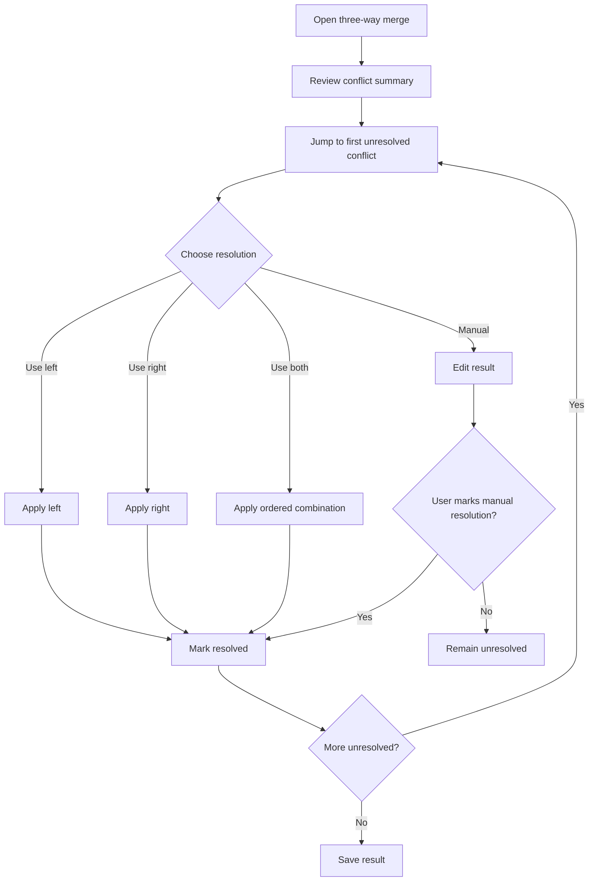

# RFC 034: Conflict Resolution Workspace

**Status.** Proposed

## Status
Proposed. (Originally proposed in RFC package v0.4.)

## Summary

Design the user workflow and UI for resolving merge conflicts produced by three-way merge. The workspace must keep conflicts visible, navigable, and safe to resolve without overwhelming users.

## Motivation

Three-way merge without a good conflict workflow is dangerous. Users need to understand what changed, choose a resolution, manually edit when necessary, and know whether the result is safe to save.

## Goals

- Provide clear conflict navigation.
- Provide per-conflict resolution actions.
- Support manual result editing.
- Track resolution status explicitly.
- Prevent accidental save with unresolved conflicts.

## Non-Goals

- Implement semantic language-aware merge.
- Hide conflict complexity through aggressive automatic resolution.
- Provide full IDE refactoring features.

## User Workflow



## Wireframe

```text
+----------------------------------------------------------------------------------+
| Conflict Resolution: config.toml                                                 |
+----------------------+----------------------+----------------------+-------------+
| Base                 | Left                 | Right                | Result      |
| line 120             | line 120             | line 120             | line 120    |
| common text          | changed by A         | changed by B         | editable    |
+----------------------+----------------------+----------------------+-------------+
| Conflict #3 of 12 | status: unresolved | type: both edited same region             |
| Actions: [Use Left] [Use Right] [Use Both L then R] [Use Both R then L] [Manual OK]|
| Navigation: [Previous Conflict] [Next Conflict] [Show Summary]                   |
+----------------------------------------------------------------------------------+
```

## Conflict Summary Panel

```text
+-----------------------------+
| Conflicts                   |
+-----------------------------+
| [!] #1 src/main.rs:42       |
| [✓] #2 src/lib.rs:88        |
| [!] #3 config.toml:120      |
| [?] #4 README.md:15 manual  |
+-----------------------------+
| 8 resolved / 4 unresolved   |
+-----------------------------+
```

## Resolution Actions

| Action | Result |
|---|---|
| Use Left | Replace result conflict range with left range |
| Use Right | Replace result conflict range with right range |
| Use Both L then R | Concatenate left then right with policy-defined separator |
| Use Both R then L | Concatenate right then left with policy-defined separator |
| Manual OK | Mark current manually edited result range as resolved |
| Reopen | Mark resolved conflict as unresolved again |

## Internal Design

### Conflict Resolution Transaction

```rust
pub enum ConflictResolutionAction {
    UseLeft { conflict: ConflictId },
    UseRight { conflict: ConflictId },
    UseBoth { conflict: ConflictId, order: BothOrder },
    ManualAccept { conflict: ConflictId, result_range: TextRange },
    Reopen { conflict: ConflictId },
}
```

Every action is converted into an undoable transaction that updates both the result document and conflict status.

### State Machine

```rust
pub enum ConflictUiState {
    Viewing(ConflictId),
    EditingManual(ConflictId),
    ResolvedPreview(ConflictId),
    Summary,
}
```

## Accessibility Requirements

- Conflict navigation must be keyboard-accessible.
- Conflict status must not rely on color alone.
- Conflict actions must have visible labels and shortcuts.
- Screen reader labels must include conflict number, file path, line range, and status.

## Acceptance Criteria

- Users can resolve all conflicts without using a mouse.
- Manual edits can be marked as conflict resolution.
- Save is blocked while unresolved conflicts remain unless explicitly exported as conflict file.
- Conflict status survives session save/reopen.
- Undo/redo can revert conflict resolutions.

## Dependencies

- RFC 033 — Three-Way Merge Model
- RFC 032 — Text Editing Operation Model
- RFC 015 — Undo/Redo Transaction Log
- RFC 019 — Command/Shortcut Palette and Accessibility
