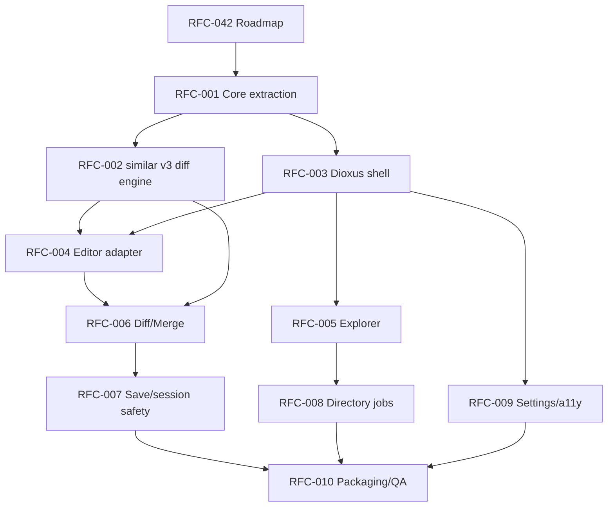

# RFC-042 — Roadmap and RFC Execution Plan

**Status.** Proposed — living document; updated for v0.141.0 (§4a extended through v0.140.0)

> **v0.141.0 update (2026-06-13).** UI polish and correctness pass complete
> (v0.111.0–v0.140.0). i18n: 158 active translation keys, zero missing,
> zero dead, zero duplicate arms. CSS: 504 lines (down from 583), no dead
> rules, no duplicate selectors. All modal aria_labels translated. Keyboard
> reference modal fully translated. `filter-btn` CSS regression fixed.
> Per-file copy in Directory Report wired. F3/Shift+F3 search navigation
> added. Keyboard shortcuts table updated in README, keyboard.md, and
> keybindings.rs. ROADMAP.md updated to v0.140.0 with correct test count
> (936) and delivered slices marked. RFC-041 checklist updated to v0.135.0.
> Project is in pre-GTK verification phase: code, tests, and docs complete.

> **v0.113.0 update (2026-06-12).** §4a extended through v0.112.0: added
> ui-logic coverage pass (v0.109.0, 228 unit tests), i18n completion
> (v0.111.0, all UI strings through `t()`), and startup diagnostics +
> troubleshooting guide (v0.112.0, RFC-026 `--diagnostics` flag).

> **v0.104.0 update (2026-06-12).** §4a extended through v0.104.0 with all
> post-v0.40 deliveries (RFC-059 audit, dir-compare, search, atomic ops,
> spreadsheet diff, settings, command registry, conflict nav, view-model
> layer, CSS contract, platform diagnostics, UI stabilisation).
> §4b priority table fully audited against `rfcs/done/`: priorities 1–7
> are all shipped at core layer (verified). Only the editor adapter track
> (RFC-004/016/025/040/032/035), packaging/QA (RFC-010/026), and the v1.0
> governance gate (RFC-041) remain open.

> **v0.102.0 update (2026-06-12).** UI stabilisation phase well advanced.
> 891 tests pass (646 core unit + 43 core integration + 189 ui-logic + 14 other).
> i18n is complete: all `t()` callsites have Japanese translations.
> Three-way merge corpus (16 tests, 6 fixture triples) added.
> Patch export UI wired. PlatformInfo wired to About panel.
> User documentation complete (17 doc files, CONTRIBUTING.md, known-limitations.md).
> RFC-041 checklist: 12 of 16 items ticked; remaining 4 require GTK (3) or are deferred (2).
> `ROADMAP.md` at the project root is the primary orientation document.
> RFC-042 remains open as a living governance document.

> **v0.73.0 update (2026-06-12).** The core data layer is complete. 39 of 48
> RFCs are implemented. 629 tests pass. `ROADMAP.md` at the project root is
> now the primary orientation document for the UI implementation phase.
> RFC-042 remains open as a living governance document.

> **v0.40.0 update (2026-06-10).** The migration described in §4 is
> substantially complete. The original M0–M10 milestone sequence executed
> in a different order and at different version numbers than projected, but
> all core and shell milestones are shipped. §4a below records actual
> delivery; §4b gives the forward roadmap from v0.40 onward. The editor
> adapter track (M4, RFC-004) remains the one major unstarted milestone.

> Adoption note: originally drafted as "RFC-000" in the migration RFC package.
> Renumbered to RFC-042 at repository adoption because RFC-000 is the RFC
> lifecycle policy (`../done/000-rfc-lifecycle-policy.md`). Inbound
> references were updated in the same commit. Numbers are stable from now on.

---toml
project = "ForskScope"
rfc = "042"
title = "Roadmap and RFC Execution Plan"
status = "proposed"
phase = "planning"
target_stack = "Rust core + Dioxus desktop + similar v3 + editor adapter"
reviewers = ["project owner", "GUI architect", "Rust implementation lead"]
---

## 1. Executive Summary

This RFC converts the adopted Dioxus migration direction into an implementation roadmap. The roadmap prioritizes correctness of diff/merge product state before UI polish, while still acknowledging that the editor surface is the highest-risk UI area.

The migration is not merely a frontend port from Svelte to Dioxus. It is a restructuring into:

```text
forskscope-core
  canonical file/session/diff/merge model
  normalized diff engine integration
  save and safety policy
  directory comparison jobs

forskscope-ui
  desktop shell
  workspaces
  dialogs
  command routing
  styling

forskscope-editor-adapter
  editable text surface integration
  decorations
  selection/cursor/scroll events
  bridge between editor state and Rust truth
```

The roadmap is designed to keep the app usable after each vertical slice. It avoids a big-bang rewrite.

## 2. Product Direction

ForskScope is a local, cross-platform diff and merge workstation tool for users who want a practical alternative to WinMerge-style workflows on Unix/Linux and other desktop environments.

The migration target is Dioxus because the product requires a rich editable text surface. Iced remains technically attractive for native Rust GUI work, but the risk of building a WinMerge-class editor widget in Iced is too high for the current migration phase.

## 3. Migration Principles

### 3.1 Core First

All file, diff, merge, save, and directory-comparison decisions must be expressible without Dioxus. The UI may request operations but must not define product truth.

### 3.2 Editor Adapter, Not Editor-Centric Product State

The editor surface may provide text editing, selections, cursors, keybindings, and visual decorations. It must not be the canonical owner of merge decisions, dirty state, conflict state, or save policy.

### 3.3 Small Vertical Slices

Each milestone must produce a testable slice:

```text
core test harness
→ Dioxus shell opens files
→ editor displays text
→ diff model displayed
→ merge command mutates model
→ save flow writes safely
→ directory comparison runs in background
```

### 3.4 No Silent Destructive Actions

The app must never overwrite a file without an explicit model-backed save decision. Dirty tabs, external file modification, encoding changes, and backup behavior must be visible.

### 3.5 Compatibility Before Enhancement

The current user-visible behaviors should be preserved where they are useful: two-sided explorer, tabbed diff views, text/binary/Excel handling, theme settings, and left/right comparison vocabulary. However, unsafe or incomplete behaviors should be redesigned rather than ported directly.

### 3.5 Compatibility Before Enhancement

The current user-visible behaviors should be preserved where they are useful: two-sided explorer, tabbed diff views, text/binary/Excel handling, theme settings, and left/right comparison vocabulary. However, unsafe or incomplete behaviors should be redesigned rather than ported directly.

## 4. Milestone Roadmap

### 4a. Delivered milestones (as of v0.104.0)

The sequence executed in a different order than §4-original projected, but
all core and shell slices shipped. Extended below through v0.104.0.

| Planned | Shipped in | RFC | What landed |
|---------|-----------|-----|-------------|
| M0 Planning | — | RFC-042 | This RFC |
| M1 Core extraction | v0.23.0 | RFC-001 | `forskscope-core` crate, domain model |
| M2 Diff engine | v0.23.0 | RFC-002 | `similar` v3, normalized diff/inline model |
| M3 Dioxus shell | v0.23.0 | RFC-003 | App shell, tabs, state runtime |
| M5 Explorer | v0.25.0 | RFC-005 | Two-pane explorer, digest status |
| M6 Diff/Merge | v0.26.0 | RFC-006 | Hunk nav, merge transactions, undo/redo |
| M7 Save safety | v0.27.0 | RFC-007 | Atomic write, backup, dirty-close, fingerprint |
| — Document buffer | v0.28.0 | RFC-021 | Loaded document + result buffer model |
| — Explorer tree | v0.36.0 | RFC-054 | Tree view, breadcrumb nav, ignore patterns |
| — Settings layout | v0.36.0 | RFC-055–057 | Settings dialog, path nav, ignore UI |
| — Patch export | v0.39.0 | RFC-039 | Unified-diff export from file/directory diffs |
| — Three-way merge | v0.40.0 | RFC-033 | `ThreeWayMergeSession` diff3 engine + resolution |
| — RFC-059 audit | v0.41.0 | RFC-059 | CSS fixes, Explorer accessibility audit |
| — Dir-compare core | v0.42.0 + v0.58.0 | RFC-037 | Cancellation, `DirectoryIndex`, `EqualityEvidence` |
| — Search core | v0.43.0 | RFC-014 | `MatchIndex`, `SearchIndex`, inline search |
| — Atomic ops core | v0.44.0 | RFC-023 | `BatchManifest`, `batch_copy`, restore |
| — Spreadsheet diff | v0.57.0 | RFC-058 | `SpreadsheetDiff`, sheets-diff v2.2.1 adapter |
| — Settings core | v0.60.0 | RFC-009 | `UserSettings`, theme/font/density persistence |
| — Command registry | v0.63.0 | RFC-019 | `CommandRegistry`, 25 `cmd::*` const IDs |
| — Conflict nav | v0.64.0 | RFC-034 | `ConflictNavigator`, conflict workspace core |
| — View-model layer | v0.74–v0.87 | — | 14 `ui-logic` modules, 189 tests |
| — CSS contract | v0.88.0 | RFC-024 | `fs-line-*`, `fs-inline-*`, `fsk-conflict-*` |
| — Platform diag | v0.93.0 | RFC-026 | `PlatformInfo::collect()`, `to_report()` |
| — UI stabilisation | v0.92–v0.104 | RFC-030 | 4-bug UI fix, i18n complete, docs, merge corpus |
| — ui-logic coverage | v0.109.0 | — | All 14 ui-logic modules have field-level test coverage (228 unit tests) |
| — i18n complete | v0.111.0 | RFC-009 | Every UI string through `t()`; Japanese interface complete |
| — Startup diag + troubleshooting | v0.112.0 | RFC-026 | `--diagnostics` CLI flag; `troubleshooting.md` for WebView/Linux |

M4 (editor adapter, RFC-004) is the one major planned milestone not yet
started. M8–M10 (directory jobs, settings/a11y, packaging/QA) are partially
delivered but not fully complete at UI layer.

### 4b. Forward roadmap from v0.41.0

Priorities derived from the v0.40 backlog write-up
(`rfcs/notes/proposed-rfc-backlog-writeup-v0.40.md`) and RFC-059 audit.
Status updated at v0.104.0 — all items audited against `rfcs/done/`.

| Priority | RFC(s) | What | Status |
|----------|--------|------|--------|
| 1 | RFC-034 | Conflict resolution workspace UI (three-way) | **Done** (core v0.64.0); UI workspace requires GTK |
| 2 | RFC-059 + RFC-019 | Explorer keyboard completeness, CSS fixes, align-module tests | **Done** (RFC-059 v0.41.0, RFC-019 core v0.63.0); remaining UI items require GTK |
| 3 | RFC-037 | Scalable dir-compare: cancellation, incremental refresh | **Done** (core v0.42.0 + v0.58.0); persistent index cache deferred |
| 4 | RFC-014 | Search next/prev traversal + scroll-to-match | **Done** (core v0.43.0); Explorer filter UI and regex mode deferred to UI layer |
| 5 | RFC-023 | Digest-cache lifetime + directory-batch atomicity | **Done** (core v0.44.0); restore-picker UI deferred to UI layer |
| 6 | RFC-058 | Spreadsheet structured diff adapter + test corpus | **Done** (v0.57.0, migrated to sheets-diff v2.2.1) |
| 7 | RFC-009 + RFC-019 | Full i18n coverage + command registry | **Done** (RFC-009 core v0.60.0, RFC-019 core v0.63.0, i18n complete v0.102.0) |
| 8 | RFC-004 → RFC-025 gate | Editor adapter — prototype first, then RFC-016/040/032/035 | Open — deferred; requires GTK + CodeMirror |
| 9 | RFC-010 + RFC-026 | Packaging QA matrix, cross-platform smoke tests | Open — deferred; requires cross-platform CI |
| 10 | RFC-041 | v1.0 stabilization + governance | Open — 12/16 checklist items done |

**Summary:** Priorities 1–7 are all shipped at core layer. The remaining
open work is entirely the **editor adapter track** (RFC-004 and dependents),
**packaging/QA** (RFC-010, RFC-026), and the **v1.0 governance gate**
(RFC-041). All three require either a GTK build environment or cross-platform
CI infrastructure that is not yet set up.

The **three immediate non-GTK work items** identified at v0.103.0 have been
resolved: RFC-058 was already done (v0.57.0), not open as previously stated.

## 4-original. Original milestone table (preserved for reference)

| Milestone | Main Purpose | Primary RFCs | Gate |
|---|---|---|---|
| M0 | Planning and RFC baseline | RFC-042 | RFC set accepted |
| M1 | Core extraction | RFC-001 | Core tests run without GUI |
| M2 | Diff engine normalization | RFC-002 | Stable line/inline diff model |
| M3 | Dioxus shell | RFC-003 | App shell opens and routes commands |
| M4 | Editor adapter | RFC-004 | Text opens in editor with model sync |
| M5 | Explorer workspace | RFC-005 | Directory pair selection opens diff tab |
| M6 | Diff/Merge workspace | RFC-006 | Hunk navigation and merge transactions work |
| M7 | Save/session safety | RFC-007 | Dirty/conflict/save policy complete |
| M8 | Directory comparison jobs | RFC-008 | Background digest compare with progress/cancel |
| M9 | Settings and accessibility | RFC-009 | Themes, shortcuts, localization, a11y pass |
| M10 | Packaging and QA | RFC-010 | Cross-platform release candidate |

## 5. RFC Dependency Graph



## 6. Vertical Slice Strategy

### Slice A — Core Diff CLI/Test Harness

Deliver a non-GUI crate that loads two paths, detects file kinds, decodes text, computes normalized line diffs, and exposes a stable result object.

Success criteria:

- No Tauri dependency.
- No Dioxus dependency.
- Unit tests and golden tests exist.
- Existing representative files can be compared.

### Slice B — Minimal Dioxus App Opens Two Files

Deliver a Dioxus desktop shell that opens two paths by dialog or startup arguments and displays file metadata and raw text.

Success criteria:

- The Dioxus app starts on Linux, Windows, and macOS development machines.
- The app can load two local files through Rust-side filesystem APIs.
- Errors appear as model-backed UI states, not panics.

### Slice C — Editor Surface Integration

Deliver editor adapter proof of concept.

Success criteria:

- The editor can display left and right text.
- Editor changes produce structured Rust events.
- Rust can push full document updates and decorations into the editor.
- Cursor, selection, and scroll events can be observed.

### Slice D — Diff/Merge MVP

Deliver hunk navigation and one-direction merge from model to working document.

Success criteria:

- Hunks have stable IDs.
- Copy left-to-right and right-to-left modify the canonical working model.
- Undo/redo is transaction-based.
- The editor reflects the Rust model after each transaction.

### Slice E — Safe Save MVP

Deliver save confirmation, conflict detection, optional backup, and dirty close handling.

Success criteria:

- No silent overwrite.
- External file modification is detected by fingerprint.
- Backup behavior is deterministic.
- Save outcome is represented as a domain result.

### Slice F — Directory Compare MVP

Deliver paired directory browsing and background digest comparison.

Success criteria:

- Directory comparison does not freeze UI.
- Long work can be cancelled.
- File rows show equal/different/missing/error states.

## 7. Implementation Order

1. RFC-001 Core extraction.
2. RFC-002 Diff engine.
3. RFC-003 Dioxus shell.
4. RFC-004 Editor adapter proof of concept.
5. RFC-006 Diff/Merge workspace skeleton.
6. RFC-007 Save/session safety.
7. RFC-005 Explorer workspace.
8. RFC-008 Directory background jobs.
9. RFC-009 Settings/theme/localization/accessibility.
10. RFC-010 Packaging/diagnostics/QA.

The explorer can begin earlier if a second developer is available, but it should not block the core/editor proof of concept.

## 8. Release Milestones

### v0.30.0 — Core Foundation Preview

Contains extracted core, diff engine migration, and test harness. The UI may still be incomplete.

### v0.40.0 — Dioxus Shell Preview

Contains Dioxus app shell, path opening, simple text display, and minimal tabs.

### v0.50.0 — Editor Proof Preview

Contains editor adapter proof of concept and read-only side-by-side diff display.

### v0.60.0 — Merge MVP

Contains hunk navigation, model-backed merge operations, undo/redo, and dirty-state tracking.

### v0.70.0 — Safe Save MVP

Contains conflict-safe save flows and close-dirty-tab dialogs.

### v0.80.0 — Directory Compare MVP

Contains background directory comparison and explorer-driven compare workflows.

### v0.90.0 — Release Candidate

Contains settings, accessibility pass, diagnostics, packaging, and cross-platform QA matrix.

## 9. Risk Register

| Risk | Severity | Mitigation |
|---|---:|---|
| Editor adapter cannot support required decorations or scroll sync | High | Create RFC-004 proof before deep UI work. |
| Merge state drifts from editor content | High | Rust core owns document model; adapter emits transactions. |
| Large files freeze UI | High | Introduce file-size thresholds and background jobs. |
| Encoding round-trip corrupts content | High | Preserve original encoding metadata and require explicit conversion. |
| Dioxus desktop WebView differences cause platform issues | Medium | Keep core independent; define platform QA in RFC-010. |
| UI rewrite becomes a big-bang project | High | Enforce vertical slices and compatibility gates. |
| Directory digest comparison becomes expensive | Medium | Use cancellation, progress, and optional caching. |

## 10. RFC Acceptance Policy

Each RFC must answer:

1. What user-facing behavior changes?
2. What domain model or API changes?
3. What must remain independent from Dioxus?
4. What tests prove correctness?
5. What migration path exists from the current Tauri/Svelte code?
6. What is explicitly out of scope?

## 11. Reference Notes

The implementation design assumes Dioxus desktop as the adopted UI target for now, `similar` v3 as the diff engine target, and a web editor component such as CodeMirror behind an adapter boundary if required by the editable merge surface. These dependencies must be pinned in actual implementation RFC amendments before coding begins.
