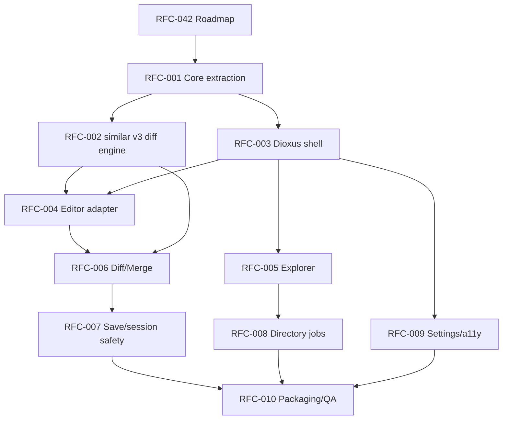

# RFC-042 — Roadmap and RFC Execution Plan

**Status.** Proposed
> Adoption note: originally drafted as "RFC-000" in the migration RFC package.
> Renumbered to RFC-042 at repository adoption because RFC-000 is the RFC
> lifecycle policy (`../done/000-rfc-lifecycle-policy.md`). Inbound
> references were updated in the same commit. Numbers are stable from now on.

---toml
project = "ForskScope"
rfc = "042"
title = "Roadmap and RFC Execution Plan"
status = "proposed"
phase = "planning"
target_stack = "Rust core + Dioxus desktop + similar v3 + editor adapter"
reviewers = ["project owner", "GUI architect", "Rust implementation lead"]
---

## 1. Executive Summary

This RFC converts the adopted Dioxus migration direction into an implementation roadmap. The roadmap prioritizes correctness of diff/merge product state before UI polish, while still acknowledging that the editor surface is the highest-risk UI area.

The migration is not merely a frontend port from Svelte to Dioxus. It is a restructuring into:

```text
forskscope-core
  canonical file/session/diff/merge model
  normalized diff engine integration
  save and safety policy
  directory comparison jobs

forskscope-ui-dioxus
  desktop shell
  workspaces
  dialogs
  command routing
  styling

forskscope-editor-adapter
  editable text surface integration
  decorations
  selection/cursor/scroll events
  bridge between editor state and Rust truth
```

The roadmap is designed to keep the app usable after each vertical slice. It avoids a big-bang rewrite.

## 2. Product Direction

ForskScope is a local, cross-platform diff and merge workstation tool for users who want a practical alternative to WinMerge-style workflows on Unix/Linux and other desktop environments.

The migration target is Dioxus because the product requires a rich editable text surface. Iced remains technically attractive for native Rust GUI work, but the risk of building a WinMerge-class editor widget in Iced is too high for the current migration phase.

## 3. Migration Principles

### 3.1 Core First

All file, diff, merge, save, and directory-comparison decisions must be expressible without Dioxus. The UI may request operations but must not define product truth.

### 3.2 Editor Adapter, Not Editor-Centric Product State

The editor surface may provide text editing, selections, cursors, keybindings, and visual decorations. It must not be the canonical owner of merge decisions, dirty state, conflict state, or save policy.

### 3.3 Small Vertical Slices

Each milestone must produce a testable slice:

```text
core test harness
→ Dioxus shell opens files
→ editor displays text
→ diff model displayed
→ merge command mutates model
→ save flow writes safely
→ directory comparison runs in background
```

### 3.4 No Silent Destructive Actions

The app must never overwrite a file without an explicit model-backed save decision. Dirty tabs, external file modification, encoding changes, and backup behavior must be visible.

### 3.5 Compatibility Before Enhancement

The current user-visible behaviors should be preserved where they are useful: two-sided explorer, tabbed diff views, text/binary/Excel handling, theme settings, and left/right comparison vocabulary. However, unsafe or incomplete behaviors should be redesigned rather than ported directly.

## 4. Milestone Roadmap

| Milestone | Main Purpose | Primary RFCs | Gate |
|---|---|---|---|
| M0 | Planning and RFC baseline | RFC-042 | RFC set accepted |
| M1 | Core extraction | RFC-001 | Core tests run without GUI |
| M2 | Diff engine normalization | RFC-002 | Stable line/inline diff model |
| M3 | Dioxus shell | RFC-003 | App shell opens and routes commands |
| M4 | Editor adapter | RFC-004 | Text opens in editor with model sync |
| M5 | Explorer workspace | RFC-005 | Directory pair selection opens diff tab |
| M6 | Diff/Merge workspace | RFC-006 | Hunk navigation and merge transactions work |
| M7 | Save/session safety | RFC-007 | Dirty/conflict/save policy complete |
| M8 | Directory comparison jobs | RFC-008 | Background digest compare with progress/cancel |
| M9 | Settings and accessibility | RFC-009 | Themes, shortcuts, localization, a11y pass |
| M10 | Packaging and QA | RFC-010 | Cross-platform release candidate |

## 5. RFC Dependency Graph



## 6. Vertical Slice Strategy

### Slice A — Core Diff CLI/Test Harness

Deliver a non-GUI crate that loads two paths, detects file kinds, decodes text, computes normalized line diffs, and exposes a stable result object.

Success criteria:

- No Tauri dependency.
- No Dioxus dependency.
- Unit tests and golden tests exist.
- Existing representative files can be compared.

### Slice B — Minimal Dioxus App Opens Two Files

Deliver a Dioxus desktop shell that opens two paths by dialog or startup arguments and displays file metadata and raw text.

Success criteria:

- The Dioxus app starts on Linux, Windows, and macOS development machines.
- The app can load two local files through Rust-side filesystem APIs.
- Errors appear as model-backed UI states, not panics.

### Slice C — Editor Surface Integration

Deliver editor adapter proof of concept.

Success criteria:

- The editor can display left and right text.
- Editor changes produce structured Rust events.
- Rust can push full document updates and decorations into the editor.
- Cursor, selection, and scroll events can be observed.

### Slice D — Diff/Merge MVP

Deliver hunk navigation and one-direction merge from model to working document.

Success criteria:

- Hunks have stable IDs.
- Copy left-to-right and right-to-left modify the canonical working model.
- Undo/redo is transaction-based.
- The editor reflects the Rust model after each transaction.

### Slice E — Safe Save MVP

Deliver save confirmation, conflict detection, optional backup, and dirty close handling.

Success criteria:

- No silent overwrite.
- External file modification is detected by fingerprint.
- Backup behavior is deterministic.
- Save outcome is represented as a domain result.

### Slice F — Directory Compare MVP

Deliver paired directory browsing and background digest comparison.

Success criteria:

- Directory comparison does not freeze UI.
- Long work can be cancelled.
- File rows show equal/different/missing/error states.

## 7. Implementation Order

1. RFC-001 Core extraction.
2. RFC-002 Diff engine.
3. RFC-003 Dioxus shell.
4. RFC-004 Editor adapter proof of concept.
5. RFC-006 Diff/Merge workspace skeleton.
6. RFC-007 Save/session safety.
7. RFC-005 Explorer workspace.
8. RFC-008 Directory background jobs.
9. RFC-009 Settings/theme/localization/accessibility.
10. RFC-010 Packaging/diagnostics/QA.

The explorer can begin earlier if a second developer is available, but it should not block the core/editor proof of concept.

## 8. Release Milestones

### v0.30.0 — Core Foundation Preview

Contains extracted core, diff engine migration, and test harness. The UI may still be incomplete.

### v0.40.0 — Dioxus Shell Preview

Contains Dioxus app shell, path opening, simple text display, and minimal tabs.

### v0.50.0 — Editor Proof Preview

Contains editor adapter proof of concept and read-only side-by-side diff display.

### v0.60.0 — Merge MVP

Contains hunk navigation, model-backed merge operations, undo/redo, and dirty-state tracking.

### v0.70.0 — Safe Save MVP

Contains conflict-safe save flows and close-dirty-tab dialogs.

### v0.80.0 — Directory Compare MVP

Contains background directory comparison and explorer-driven compare workflows.

### v0.90.0 — Release Candidate

Contains settings, accessibility pass, diagnostics, packaging, and cross-platform QA matrix.

## 9. Risk Register

| Risk | Severity | Mitigation |
|---|---:|---|
| Editor adapter cannot support required decorations or scroll sync | High | Create RFC-004 proof before deep UI work. |
| Merge state drifts from editor content | High | Rust core owns document model; adapter emits transactions. |
| Large files freeze UI | High | Introduce file-size thresholds and background jobs. |
| Encoding round-trip corrupts content | High | Preserve original encoding metadata and require explicit conversion. |
| Dioxus desktop WebView differences cause platform issues | Medium | Keep core independent; define platform QA in RFC-010. |
| UI rewrite becomes a big-bang project | High | Enforce vertical slices and compatibility gates. |
| Directory digest comparison becomes expensive | Medium | Use cancellation, progress, and optional caching. |

## 10. RFC Acceptance Policy

Each RFC must answer:

1. What user-facing behavior changes?
2. What domain model or API changes?
3. What must remain independent from Dioxus?
4. What tests prove correctness?
5. What migration path exists from the current Tauri/Svelte code?
6. What is explicitly out of scope?

## 11. Reference Notes

The implementation design assumes Dioxus desktop as the adopted UI target for now, `similar` v3 as the diff engine target, and a web editor component such as CodeMirror behind an adapter boundary if required by the editable merge surface. These dependencies must be pinned in actual implementation RFC amendments before coding begins.
